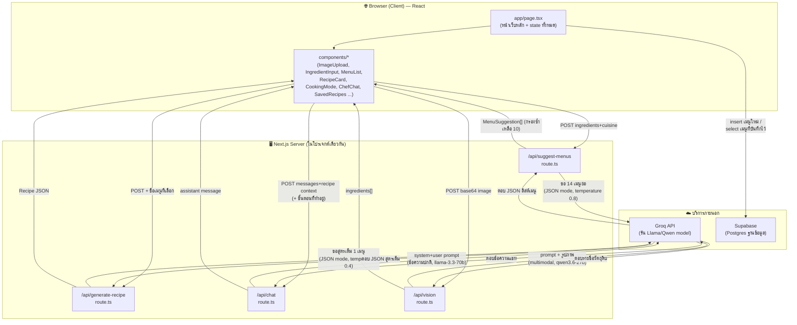
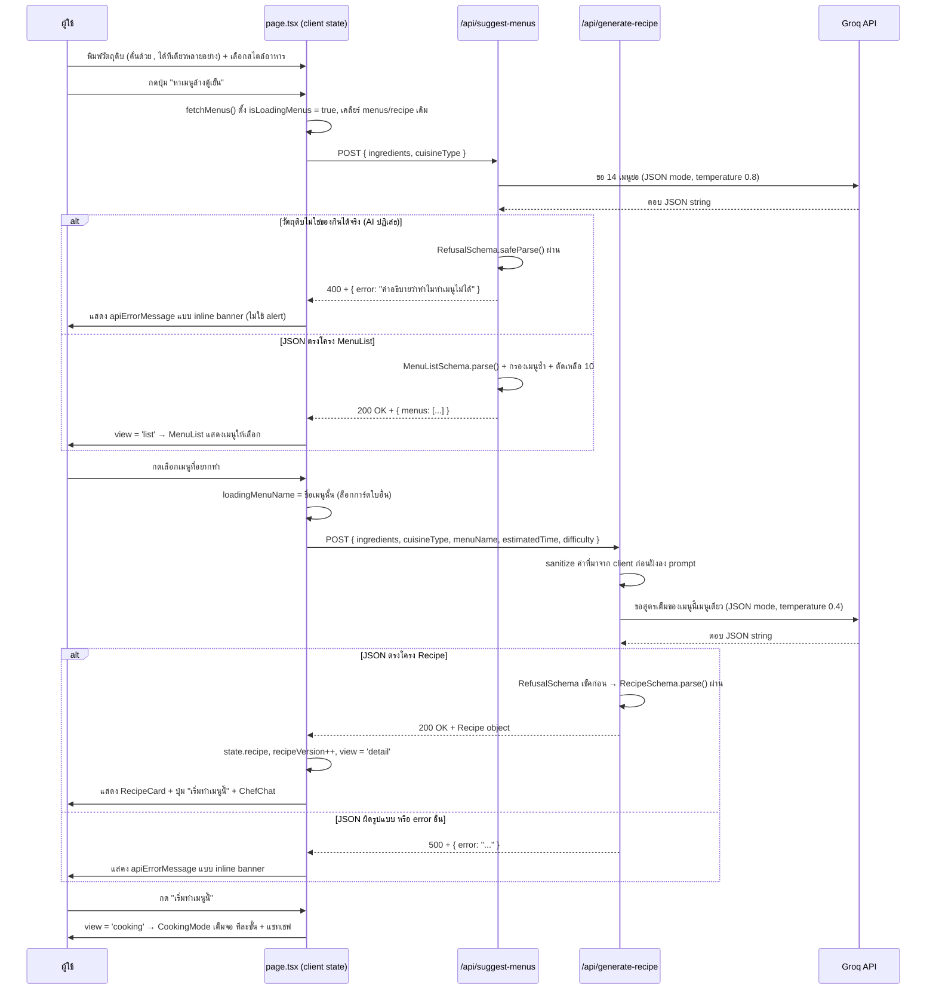
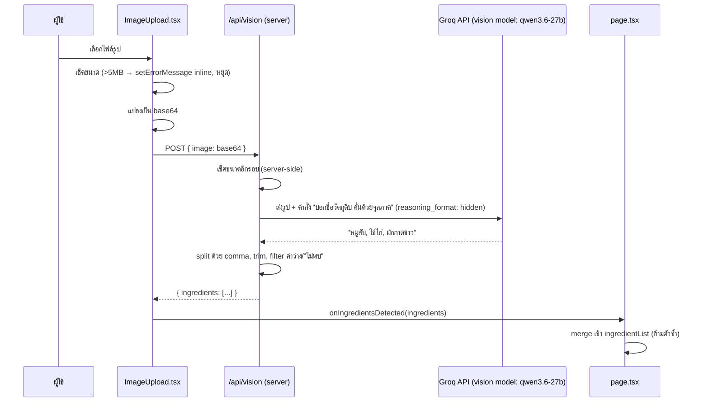
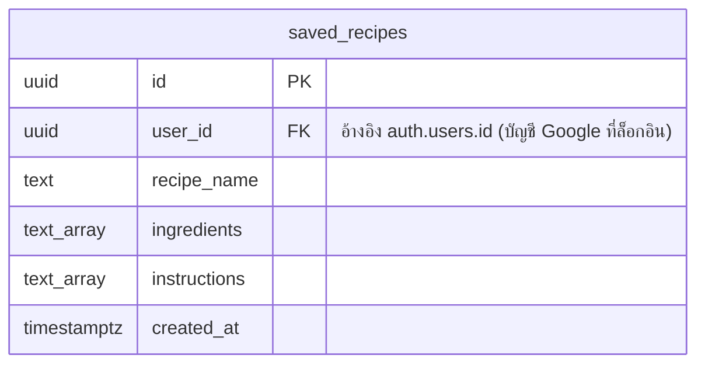

# 📘 PROJECT_GUIDE — คู่มือทำความเข้าใจโปรเจกต์ "ล้างตู้เย็น" (fridge-menu)

เอกสารนี้เขียนสำหรับคนที่ **ไม่เคยเห็นโปรเจกต์นี้มาก่อนเลย** อ่านจบแล้วควรเข้าใจว่าโปรเจกต์นี้ทำอะไร โครงสร้างเป็นยังไง โค้ดวิ่งยังไงตั้งแต่ผู้ใช้กดปุ่มจนได้ผลลัพธ์ และมีจุดไหนที่ต้องระวังเวลาไปแก้ต่อ ถ้าเจอศัพท์เทคนิคที่ไม่คุ้น ให้ข้ามไปดูหัวข้อ [Glossary](#8-glossary) ได้เลย — ทุกคำถูกอธิบายไว้ที่นั่น

> **เอกสารนี้อัปเดตล่าสุด: 2026-07-29 — สถานะปัจจุบันคือฟีเจอร์หลักทุกตัวใช้งานได้จริงหมดแล้ว** รวมถึงการบันทึก/โหลดเมนูผ่าน Supabase ที่เคยพังก็แก้แล้ว ถ้าไปเจอเอกสารอื่นในโปรเจกต์ (`CODE_WALKTHROUGH.md`, `USER_REVIEW.md`) ที่พูดถึงฟีเจอร์ที่ "ใช้งานไม่ได้" ให้รู้ไว้ว่านั่นคือ snapshot ตอนที่ยังพังอยู่ ไม่ใช่สถานะตอนนี้ — ดูสรุปสิ่งที่แก้ไปแล้วทั้งหมดใน [หัวข้อ 7](#7-จุดที่ต้องระวัง)

---

## สารบัญ

1. [ภาพรวม](#1-ภาพรวม)
2. [สถาปัตยกรรม](#2-สถาปัตยกรรม)
3. [โครงสร้างโฟลเดอร์](#3-โครงสร้างโฟลเดอร์)
4. [Flow การทำงานหลัก](#4-flow-การทำงานหลัก)
5. [Database](#5-database)
6. [วิธีรันโปรเจกต์](#6-วิธีรันโปรเจกต์)
7. [จุดที่ต้องระวัง](#7-จุดที่ต้องระวัง)
8. [Glossary](#8-glossary)
9. [Changelog (สรุปการเปลี่ยนแปลงล่าสุด)](#9-changelog-สรุปการเปลี่ยนแปลงล่าสุด)

---

## 1. ภาพรวม

### ปัญหาที่โปรเจกต์นี้แก้

หลายคนเจอสถานการณ์: เปิดตู้เย็นมามีวัตถุดิบกระจัดกระจาย (ไข่ 2 ฟอง, ผักที่ใกล้เน่า, ปลากระป๋องเหลือ 1 กระป๋อง) แต่คิดไม่ออกว่าจะทำเมนูอะไรจากของพวกนี้ สุดท้ายมักจบด้วยการสั่งเดลิเวอรี่ หรือทิ้งวัตถุดิบไปเปล่าๆ (food waste)

**"ล้างตู้เย็น"** คือเว็บแอปที่แก้ปัญหานี้ตรงๆ: ผู้ใช้บอกว่ามีวัตถุดิบอะไร (พิมพ์เอง หรือถ่ายรูปให้ AI ดูแทน) เลือกสไตล์อาหารที่อยากกิน แล้วให้ AI ที่สวมบทเป็น "เชฟบริหารมือหนึ่ง (Executive Chef de Cuisine)" คิดเมนูให้ 1 เมนู พร้อมสูตรทำแบบละเอียด ข้อมูลโภชนาการคร่าวๆ และเคล็ดลับจากเชฟ — ถ้ามีคำถามต่อ (เช่น "ไม่มีน้ำปลาใช้อะไรแทน") ก็คุยกับ AI ต่อได้ในแชทที่โผล่มาพร้อมกับเมนู แล้วยังกดหัวใจบันทึกเมนูที่ชอบไว้ดูย้อนหลังได้ด้วย

### หน้าตาของแอปโดยสรุป

เป็นเว็บ **หน้าเดียว** (ไม่มีหน้า login, ไม่มีหน้า profile, ไม่มี URL ย่อย) ทุกอย่างเกิดขึ้นในหน้าเดียวกันหมด: อัปโหลดรูป/พิมพ์วัตถุดิบ → เลือกสไตล์อาหาร → กดปุ่ม → เห็นเมนู → คุยกับ AI ต่อ → (ถ้าชอบ) กดหัวใจเก็บไว้ → เปิดดู "เมนูที่บันทึกไว้" ย้อนหลังได้

### เทคโนโลยีที่ใช้ และเหตุผลที่เลือก

| เทคโนโลยี | ใช้ทำอะไร | ทำไมถึงเลือกใช้ (เดาจากลักษณะโปรเจกต์) |
|---|---|---|
| **Next.js** (App Router) | Framework หลักของทั้งแอป | Next.js ทำให้เขียน "หน้าเว็บ" (frontend) และ "API สำหรับประมวลผล" (backend) อยู่ในโปรเจกต์เดียวกันได้ ไม่ต้องแยกรัน server คนละตัว เหมาะกับโปรเจกต์เล็ก-กลางที่อยากเริ่มเร็ว และ deploy ขึ้น Vercel ได้ทันทีแบบไม่ต้องเซ็ตอะไรเพิ่ม |
| **React** | เขียน UI เป็นชิ้นๆ (component) | มาคู่กับ Next.js อยู่แล้ว เป็นมาตรฐานของอุตสาหกรรมสำหรับ UI ที่มีการเปลี่ยนแปลงข้อมูลบ่อย (เช่น พิมพ์วัตถุดิบ, กดปุ่ม, รอผล AI) |
| **TypeScript** | JavaScript ที่มีการ "กำหนดชนิดข้อมูล" (type) | ป้องกัน bug จากการส่งข้อมูลรูปทรงผิด — สำคัญมากในโปรเจกต์นี้เพราะข้อมูลเมนูวิ่งผ่านหลายชั้น (AI → backend → frontend → component) ถ้าไม่มี type จะรู้ตัวว่าพลาดก็ตอนแอปพังไปแล้ว |
| **Tailwind CSS v4** | เขียนสไตล์ (CSS) โดยใส่ class สำเร็จรูปตรงใน HTML/JSX | เร็วกว่าเขียนไฟล์ CSS แยก ไม่ต้องคิดชื่อ class เอง เหมาะกับทำ UI คนเดียวหรือทีมเล็ก |
| **shadcn/ui** | ชุด component สำเร็จรูป (ปุ่ม, การ์ด, input, badge) | ไม่ต้องเขียนปุ่ม/การ์ดเองตั้งแต่ศูนย์ ได้ดีไซน์ที่ดูเป็นมืออาชีพทันที และปรับแต่งโค้ดได้เองเพราะโค้ดถูกก็อปปี้มาไว้ในโปรเจกต์ตรงๆ (ไม่ใช่ library ที่ดึงจาก npm แบบปิดกล่อง) |
| **Groq** | บริการรัน AI model (LLM) ให้เราเรียกใช้ผ่าน API | Groq ขึ้นชื่อเรื่อง "เร็วมาก" (ใช้ชิปพิเศษที่เขาออกแบบเอง) และให้เรียกโมเดล open-source อย่าง Llama/Qwen ได้ในราคาที่โอเคสำหรับโปรเจกต์ที่ต้องการ response เร็ว (เช่นแอปแชท/สร้างเนื้อหาแบบ real-time) — **ข้อควรรู้:** Groq เป็นแค่ "คนรันโมเดลให้เร็ว" ไม่ใช่เจ้าของโมเดล และเคย**ถอดโมเดลออกจากบริการจริง**ระหว่างที่โปรเจกต์นี้พัฒนาอยู่ (ดูแถวถัดไป) — เป็นความเสี่ยงที่ต้องรู้ไว้ ไม่ใช่แค่ทฤษฎี |
| **Llama 3.3 70B** (ข้อความ) + **Qwen3.6 27B** (รูปภาพ) | โมเดล AI ที่ใช้จริง (ผ่าน Groq) | `llama-3.3-70b-versatile` ใช้สร้างข้อความ/JSON (คิดเมนู, ตอบแชท) ส่วนงาน "ดูรูป" (สแกนวัตถุดิบจากภาพ) เดิมใช้ `meta-llama/llama-4-scout-17b-16e-instruct` แต่ **โมเดลนี้ถูก Groq ถอดออกจากบริการไปแล้วระหว่างทาง** (ยิงไปแล้วได้ 404 model_not_found) จึงเปลี่ยนมาใช้ `qwen/qwen3.6-27b` แทน ซึ่งเป็นโมเดลที่ดูรูปได้เหมือนกัน (multimodal) แต่เป็น "reasoning model" ต้องตั้งค่าพิเศษเพิ่ม (ดู [หัวข้อ 7](#7-จุดที่ต้องระวัง)) |
| **Zod** | ตรวจสอบรูปแบบข้อมูล (schema validation) | AI ตอบเป็น JSON แต่ AI ไม่ได้ "การันตี" ว่าจะตอบตรงรูปแบบที่ขอเสมอ — Zod ใช้เช็คก่อนว่า JSON ที่ AI ส่งมาตรงโครงที่ต้องการจริงไหม ถ้าไม่ตรงจะรู้ตัวทันทีแทนที่จะปล่อยข้อมูลผิดรูปไปแสดงผลจนแอปพัง |
| **Supabase** | ฐานข้อมูล (Postgres) แบบ hosted พร้อม client library | ไม่ต้องตั้ง database server เอง สมัครแล้วได้ Postgres ใช้งานผ่าน API ทันที เหมาะกับฟีเจอร์เล็กๆอย่าง "บันทึกเมนูที่ชอบ" ที่ไม่คุ้มจะตั้ง backend database เต็มรูปแบบ |

---

## 2. สถาปัตยกรรม

### Concept ที่ต้องเข้าใจก่อน: Client-Server และทำไม AI ต้องเรียกจาก "server" เท่านั้น

เว็บแอปทุกตัวแบ่งเป็น 2 ฝั่งคร่าวๆ: **ฝั่ง client** (browser ของผู้ใช้ — รันโค้ด JavaScript ที่ทุกคนเปิด DevTools ดูได้) และ **ฝั่ง server** (เครื่องที่รันโค้ดอยู่ลับๆ ไม่มีใครเห็น source code หรือ secret key ได้)

ในโปรเจกต์นี้ **API key ของ Groq ต้องเก็บไว้ฝั่ง server เท่านั้น** เพราะถ้าเผลอเอาไปใส่โค้ดฝั่ง client ใครก็เปิด DevTools มาก็อปปี้ key ไปใช้แทนได้ทันที — นี่คือเหตุผลที่การเรียก Groq ทั้งหมดถูกทำผ่าน **Route Handler** (ไฟล์ `route.ts` ใน `app/api/`) ซึ่งรันอยู่ฝั่ง server ของ Next.js เท่านั้น ไม่ได้รันในเบราว์เซอร์ผู้ใช้

### ส่วนประกอบหลักของระบบ

1. **Browser (Client)** — รันโค้ด React ที่อยู่ใน `app/page.tsx` และไฟล์ใน `components/` ทำหน้าที่แสดงผล UI, เก็บ state ชั่วคราว (วัตถุดิบที่พิมพ์, เมนูที่ได้), และยิง request ไปหา server ของตัวเอง
2. **Next.js Server (ฝั่งเดียวกับโปรเจกต์นี้)** — มี 4 endpoint (`/api/suggest-menus`, `/api/generate-recipe`, `/api/chat`, `/api/vision`) ที่รับ request จาก browser แล้วไปคุยกับ Groq ต่อ
3. **Groq API (บริการภายนอก)** — รับ prompt จาก server แล้วรันโมเดลตอบกลับมาเป็นข้อความหรือ JSON
4. **Supabase (บริการภายนอก)** — ฐานข้อมูลที่ browser เรียกตรงได้เลย (ผ่าน `lib/supabase.ts`) สำหรับบันทึก/โหลดเมนูที่ชอบ (จุดนี้พิเศษ: Supabase ออกแบบให้ client เรียกตรงได้อย่างปลอดภัยโดยใช้ "anon key" ที่มีสิทธิ์จำกัด ต่างจาก Groq ที่ key มีสิทธิ์เต็มเลยต้องซ่อนไว้หลัง server)

### Diagram ภาพรวมสถาปัตยกรรม



จุดสำคัญที่ diagram นี้บอก: **ทุกลูกศรที่ไปหา Groq ต้องผ่าน Next.js Server ก่อนเสมอ** (ไม่มีลูกศรจาก Browser ตรงไปหา Groq เลย) แต่ **Supabase มีลูกศรจาก Browser ตรงเข้าไปเลย** (ไม่ผ่าน API route ของเราเอง) เพราะ Supabase ออกแบบมาให้ client เรียกได้อย่างปลอดภัยด้วยกลไกของตัวเอง (ดู Glossary หัวข้อ RLS)

---

## 3. โครงสร้างโฟลเดอร์

```
fridge-menu/
├── .env.local              # เก็บ API key จริง (gitignore ผ่าน .env* — ห้าม commit)
├── .gitignore
├── CLAUDE.md               # คำสั่งสำหรับ AI coding agent — เนื้อหาจริงคือบรรทัดเดียว `@md/AGENTS.md`
│
├── md/                     # เอกสารทั้งหมดอยู่ในนี้ (ไม่มีไฟล์ .md กระจายที่ราก)
│   ├── PROJECT_GUIDE.md      # ⭐ ไฟล์นี้ — แหล่งความจริงหลัก อ่านตัวนี้ก่อนเสมอ
│   ├── AI_CHEF_SPEC.md       # สเปกบุคลิก "AI เชฟ" ต้นแบบ (เดิมชื่อ `GEMINI.md` — เปลี่ยนเพราะโปรเจกต์ไม่ได้ใช้ Gemini)
│   │                       # เอกสารอ้างอิงล้วนๆ ไม่ได้ถูก import หรืออ่านตอนรันจริง
│   ├── CODE_WALKTHROUGH.md   # ไล่โค้ดทีละไฟล์ (เดิมชื่อ `README.md`)
│   │                       # ⚠️ ล้าสมัย — snapshot ตอนที่ Supabase/vision ยังพังอยู่ อย่าเชื่อสถานะในนั้น
│   ├── AGENTS.md             # กฎสำหรับ AI agent เรื่อง Next.js เวอร์ชันใหม่
│   └── testing.md / USER_REVIEW.md / DEAD_CODE_REPORT.md / FEATURE_IDEAS.md
│                           # "living log" ของทีม — ผลทดสอบ/รีวิวจากมุมผู้ใช้/สำรวจ dead code/ไอเดียฟีเจอร์
│                           # ไม่ใช่โค้ด แต่มีประโยชน์มากถ้าอยากรู้ "ทำไม" โค้ดถึงเป็นแบบนี้
├── package.json / package-lock.json
├── components.json           # คอนฟิกของ shadcn/ui (style: radix-nova, baseColor: neutral)
├── tsconfig.json             # ตั้งค่า TypeScript (strict mode, path alias @/* ชี้กลับ root)
├── eslint.config.mjs         # กฎ lint (extends eslint-config-next)
├── next.config.ts            # ตั้ง turbopack.root ตรงๆ กัน Next.js เดา workspace root ผิด (ดูหัวข้อ 7)
│
├── app/                      # โฟลเดอร์หลักของ Next.js App Router
│   ├── layout.tsx             # Layout ที่ครอบทุกหน้า (โหลดฟอนต์, ตั้ง <html>/<body>)
│   ├── page.tsx                # ⭐ หน้าเว็บหลักหน้าเดียวของทั้งแอป
│   ├── globals.css             # ไฟล์ธีมสี/สไตล์พื้นฐานของทั้งแอป
│   ├── favicon.ico
│   └── api/                    # โฟลเดอร์พิเศษ: ทุกไฟล์ในนี้กลายเป็น API endpoint อัตโนมัติ
│       ├── suggest-menus/route.ts    # POST /api/suggest-menus  (ลิสต์ 10 เมนูย่อให้เลือก)
│       ├── generate-recipe/route.ts  # POST /api/generate-recipe (สูตรเต็มของเมนูที่เลือก)
│       ├── chat/route.ts             # POST /api/chat
│       └── vision/route.ts           # POST /api/vision
│
├── components/                # ชิ้นส่วน UI ที่แยกไว้ใช้ซ้ำ/อ่านง่าย
│   ├── ImageUpload.tsx          # ปุ่มอัปโหลดรูป
│   ├── IngredientInput.tsx      # ช่องพิมพ์วัตถุดิบ
│   ├── IngredientList.tsx       # แสดงวัตถุดิบที่เพิ่มแล้ว
│   ├── CuisineSelector.tsx      # ปุ่มเลือกสไตล์อาหาร
│   ├── MenuList.tsx             # ลิสต์เมนูให้เลือก (ขั้นกลางระหว่างกดค้นหากับเห็นสูตรเต็ม)
│   ├── RecipeCard.tsx           # การ์ดแสดงสูตรเต็มของเมนูที่เลือก
│   ├── CookingMode.tsx          # หน้าทำอาหารเต็มจอ ทีละขั้นตอน + แชทเชฟในตัว
│   ├── SavedRecipes.tsx          # ปุ่ม toggle ดูรายการเมนูที่เคยกดหัวใจบันทึกไว้
│   ├── ChefChat.tsx              # วิดเจ็ตแชทกับ AI
│   ├── AuthButton.tsx            # ปุ่มเข้าสู่ระบบ/ออกจากระบบ (มุมขวาบนของหน้า)
│   ├── AuthDialog.tsx            # กล่องเข้าสู่ระบบ: ฟอร์มอีเมล/รหัสผ่าน + ปุ่ม Google (mount ที่ layout)
│   └── ui/                       # ชิ้นส่วนพื้นฐานที่มาจาก shadcn/ui (ปุ่ม, การ์ด, badge, input)
│
├── lib/                        # ฟังก์ชันช่วยเหลือ (utility) ที่ไม่ใช่ UI
│   ├── utils.ts                 # ฟังก์ชันรวม className (cn()) + ตารางแปลงระดับความยากเป็นไทย/สี badge
│   ├── types.ts                  # นิยาม type กลาง: `Recipe` (สูตรเต็ม) และ `MenuSuggestion` (เมนูย่อในลิสต์)
│   ├── useUser.ts                # React hook บอกว่าใครล็อกอินอยู่ (ใช้ร่วมกันหลาย component)
│   ├── authDialog.ts             # store เล็กๆ สำหรับสั่งเปิดกล่องเข้าสู่ระบบจากที่ไหนก็ได้ (startSignIn)
│   └── supabase.ts               # การเชื่อมต่อ Supabase + ฟังก์ชัน login/logout + บันทึก/โหลดเมนู
│
├── supabase/
│   ├── migration.sql            # SQL สร้างตาราง saved_recipes + เปิด RLS — รันเองในหน้า Supabase SQL Editor
│   └── migration_auth.sql       # SQL ย้าย user_id ไปผูกกับ Supabase Auth จริง — รันต่อจากไฟล์บน
│
└── public/                     # ว่างเปล่า — ไอคอน SVG default ของ create-next-app ถูกลบไปแล้ว
                                 # (เคยเป็น dead asset ที่ DEAD_CODE_REPORT.md เคยสำรวจเจอ) ไม่ต้องแปลกใจถ้าเปิดมาไม่มีไฟล์
```

**ทำไม `app/` มีโครงสร้างแบบนี้:** Next.js เวอร์ชันใหม่ (App Router) ใช้ **ชื่อโฟลเดอร์ = ชื่อ route (URL path)** โดยอัตโนมัติ เช่น โฟลเดอร์ `app/api/vision/` ที่มีไฟล์ `route.ts` ข้างใน จะกลายเป็น endpoint ที่ชื่อ `/api/vision` ทันทีโดยไม่ต้องไปตั้งค่า routing ที่ไหนเพิ่ม (concept นี้อธิบายเพิ่มใน [Glossary](#8-glossary))

---

## 4. Flow การทำงานหลัก

โปรเจกต์นี้มี 6 flow หลัก (A-F) จะไล่ทีละ flow ว่าโค้ดวิ่งผ่านไฟล์ไหนบ้าง ตั้งแต่ผู้ใช้ทำ action จนได้ผลลัพธ์

### Flow A: พิมพ์วัตถุดิบ → เลือกเมนูจากลิสต์ → สูตรเต็ม → ลงมือทำ (flow หลักของแอป)

> **หน้าเดียวแต่มี 4 ขั้น:** `page.tsx` เก็บ `state.view` เป็น `'input' | 'list' | 'detail' | 'cooking'` แล้วเลือก render เฉพาะส่วนของขั้นนั้น (ไม่ได้เปลี่ยน URL — ทั้งแอปยังเป็นหน้าเดียวเหมือนเดิม) ขั้น `cooking` พิเศษกว่าเพื่อน คือ `return` แยกออกไปเป็น `<CookingMode />` เต็มจอตั้งแต่ต้นฟังก์ชัน ไม่ผ่าน layout ปกติ เพราะคนที่ยืนอยู่หน้าเตาไม่ควรเห็นฟอร์มวัตถุดิบมากวน
>
> **จุดที่ต้องเข้าใจ: ทำไมต้องยิง AI สองรอบ** — รอบแรก (`/api/suggest-menus`) ขอแค่ "ตัวเลือกเมนูแบบย่อ" 10 เมนู รอบสอง (`/api/generate-recipe`) ค่อยขอสูตรเต็มของเมนูที่ผู้ใช้กดเลือกเมนูเดียว ถ้าให้ AI เขียนสูตรเต็มทั้ง 10 เมนูรวดเดียวจะรอนานมากและเสี่ยง timeout ทั้งที่สุดท้ายผู้ใช้ก็ทำแค่เมนูเดียว

**Step-by-step:**

1. ผู้ใช้พิมพ์คำในช่อง (component `IngredientInput.tsx`) แล้วกด Enter หรือกดปุ่ม "+ เพิ่ม"
2. เรียก prop `onAdd` ซึ่งจริงๆคือฟังก์ชัน `handleAddIngredient()` ที่อยู่ใน `app/page.tsx`
3. `handleAddIngredient()` **รองรับพิมพ์หลายอย่างพร้อมกันคั่นด้วยจุลภาคหรือขึ้นบรรทัดใหม่** (เช่น "หมู, ไข่, กะเพรา" เพิ่มได้ทีเดียว 3 อย่าง ไม่ต้องพิมพ์ทีละคำ) โดย split ข้อความด้วย regex `/[,，\n]/` ก่อน แล้ววนลูป sanitize ทีละชิ้น: ตัดช่องว่างหัว-ท้าย → กรองอักขระ `<>{}[]()"'\` ออก (ป้องกัน injection เบื้องต้น เพราะค่านี้จะถูกฝังเข้าไปใน prompt ที่ยิงให้ AI ต่อ) → ตัดความยาวไม่เกิน 50 ตัวอักษร → เช็คว่าไม่ว่างเปล่าและไม่ซ้ำกับที่มีอยู่ (ไม่สนตัวพิมพ์ใหญ่/เล็ก) ถ้าผ่านทุกเงื่อนไข → เพิ่มเข้า `state.ingredientList` (React state ที่อยู่ใน `page.tsx`)
4. UI re-render อัตโนมัติ (เพราะ React ทำงานแบบนี้: state เปลี่ยน → หน้าจอวาดใหม่) — วัตถุดิบใหม่โผล่เป็น badge ใน `IngredientList.tsx`
   > **ไม่มีอะไรถูกจำข้ามการรีเฟรชอีกแล้ว** — เดิมเก็บ 3 อย่างลง `localStorage` (`fridge-menu-ingredients`, `fridge-menu-cuisine`, `fridge-menu-recipe`) ด้วยเหตุผลว่า "ของในตู้เย็นไม่ได้เปลี่ยนตามการรีเฟรชหน้า" แต่ของจริงคือเปิดแอปมาเจอรายการของเมื่อวานค้างอยู่ แล้วต้องนั่งกดลบทีละอันก่อนเริ่มใช้รอบใหม่ ตอนนี้เลิกจำทั้งหมด เหลือ `useEffect` ตัวเดียวตอน mount ที่ `removeItem()` ทั้ง 3 key ทิ้ง (ค่าเก่าที่ค้างอยู่ในเครื่องของคนที่เคยใช้เวอร์ชันก่อนหน้าจะได้ไม่นอนอยู่ตลอดไป) — ค่าคงที่ `LEGACY_STORAGE_KEYS` ใน `page.tsx` มีไว้เพื่อการนี้อย่างเดียว ไม่ได้ใช้เขียนค่าลงไปแล้ว
5. ผู้ใช้เลือกสไตล์อาหารใน `CuisineSelector.tsx` → เก็บลง `state.cuisineType`

**ขั้นที่ 1 → 2: กดค้นหา แล้วได้ลิสต์เมนูให้เลือก**

6. ผู้ใช้กดปุ่ม "หาเมนูล้างตู้เย็น" → เรียก `fetchMenus()`
7. `fetchMenus()` ยิง `fetch('/api/suggest-menus', { method: 'POST', body: JSON.stringify({ ingredients, cuisineType }) })` — นี่คือจุดที่โค้ด "ข้ามจาก client ไป server"
8. ที่ `app/api/suggest-menus/route.ts`: ตรวจว่า `ingredients` ไม่ว่าง แล้วประกอบ prompt ที่ขอ **14 เมนู** (ขอเผื่อไว้เพราะขั้นกรองซ้ำด้านล่างมักตัดทิ้ง 2-4 เมนู) พร้อมกฎเหล็ก 9 ข้อ — ที่สำคัญคือข้อ 2 (ห้ามเอาเครื่องปรุงพื้นฐานอย่างน้ำมัน/เกลือ/น้ำปลา ไปใส่ใน `missing_ingredients` เพราะช่องนั้นมีไว้ตอบคำถามเดียวว่า "ต้องออกจากบ้านไปซื้อของไหม"), ข้อ 6-7 (ห้ามเสนอจานเดียวกันที่ต่างกันแค่ใส่/ไม่ใส่ข้าว และให้กระจายวิธีปรุง) และข้อ 8 (คำอธิบายต้องบอกรสชาติ ไม่ใช่พูดซ้ำว่าทำจากอะไร)
9. ตั้ง `temperature: 0.8` **สูงกว่า route อื่นที่ใช้ 0.4** เพราะหน้านี้ต้องการความหลากหลายของตัวเลือก ถ้าตั้งต่ำจะได้เมนูหน้าตาคล้ายกันหมด 10 อันแล้วการมีลิสต์ให้เลือกก็ไม่มีความหมาย
10. ส่งให้ Groq (`llama-3.3-70b-versatile`, JSON mode) → ได้ JSON กลับมา → เช็ค `RefusalSchema` ก่อน (ลำดับเดียวกับ `/api/generate-recipe` ด้วยเหตุผลเดียวกัน) แล้วค่อย `MenuListSchema.parse()`
11. **กรอง 2 ชั้นฝั่ง server ก่อนตอบกลับ** เพราะกฎเหล็กใน prompt อย่างเดียวเอาไม่อยู่จริง (ทดสอบแล้วโมเดลยังฝ่าฝืนทั้งสองข้อ):
    - **เมนูซ้ำ** — ถ้าชื่อเมนูหนึ่งเป็นส่วนหนึ่งของอีกชื่อ (`ผัดกะเพรา` ⊂ `ข้าวผัดกะเพรา`) ถือเป็นจานเดียวกัน เก็บอันที่มาก่อนไว้ (AI เรียงตัวที่ใช้ของในตู้เย็นได้คุ้มที่สุดไว้ต้นลิสต์) แล้วตัดให้เหลือ 10 เมนู
    - **เครื่องปรุงพื้นฐานที่หลุดเข้ามาใน `missing_ingredients`** — ตัดออกด้วยลิสต์ `STAPLE_SEASONINGS` (น้ำมัน/เกลือ/น้ำตาล/น้ำปลา/ซีอิ๊ว/ซอสถั่วเหลือง/ซอสหอยนางรม/ซอสปรุงรส/พริกไทย/น้ำส้มสายชู) ถ้าปล่อยไว้ป้าย "ต้องซื้อเพิ่ม" จะขึ้นเกือบทุกเมนูจนผู้ใช้เลิกอ่าน แล้วเมนูที่ต้องซื้อของจริงๆ ก็จะถูกกลบไปด้วย

    จากนั้น **เรียงง่าย → ปานกลาง → ยาก** ด้วย `DIFFICULTY_ORDER` เป็นขั้นสุดท้าย (ลำดับที่ AI ส่งมาสลับความยากปนกันจนดูเหมือนสุ่ม) — `sort` ของ JS เป็น stable ตั้งแต่ ES2019 เมนูที่ความยากเท่ากันจึงยังคงลำดับ "ใช้ของในตู้เย็นได้คุ้มที่สุดก่อน" ที่ AI จัดมาไว้ ไม่ได้เสียเกณฑ์นั้นไป
12. กลับมาที่ `page.tsx` → เก็บลง `state.menus` แล้วตั้ง `state.view = 'list'` → `MenuList.tsx` แสดงการ์ดเมนู แต่ละใบบอกชื่อ/คำอธิบายสั้น/ความยาก(ไทย)/เวลา และป้าย "ใช้ของที่มีอยู่แล้วครบ" หรือ "ต้องซื้อเพิ่ม: ..." ซึ่งเป็นจุดตัดสินใจจริงของคนล้างตู้เย็น

**ขั้นที่ 2 → 3: กดเลือกเมนู แล้วได้สูตรเต็ม**

13. ผู้ใช้กดการ์ดเมนูใบใดใบหนึ่ง → `handleSelectMenu(menu)` ตั้ง `state.loadingMenuName` เป็นชื่อเมนูนั้น (เก็บเป็น "ชื่อ" ไม่ใช่ `boolean` เพื่อให้รู้ว่าต้องหมุน spinner ที่การ์ดใบไหน และล็อกการ์ดอื่นไม่ให้กดซ้อนจนได้สูตรผิดเมนู)
14. ยิง `POST /api/generate-recipe` พร้อม `{ ingredients, cuisineType, menuName, estimatedTime, difficulty }` — สาม field หลังคือของใหม่: `menuName` บังคับให้ AI เขียนสูตรของเมนูที่เลือกเท่านั้นห้ามเปลี่ยนเป็นเมนูอื่น ส่วน `estimatedTime`/`difficulty` คือค่าที่การ์ดในลิสต์โชว์ไปแล้ว ส่งกลับไปล็อกให้สูตรเต็มใช้ค่าเดียวกัน (ไม่งั้นผู้ใช้เห็น "25 นาที" ในลิสต์ แล้วกดเข้าไปเจอ "20 นาที" เพราะเป็นคนละคำตอบของ AI) — ทั้งสามค่ามาจาก client จึงถูก sanitize ที่ต้น route ก่อนฝังลง prompt เสมอ
15. server ประกอบ prompt (system prompt = บุคลิกเชฟ + กฎเหล็ก, user prompt = วัตถุดิบ+สไตล์+ชื่อเมนูที่เลือก+โครง JSON) ตั้ง `temperature: 0.4` แล้วส่งให้ Groq
16. server `JSON.parse()` → เช็ค `RefusalSchema.safeParse()` ก่อน (กรณีวัตถุดิบไม่ใช่ของกินได้จริง เช่น "ตะปู", "ยางรถยนต์") ถ้าใช่ตอบ `400` ตรงๆ **โดยไม่พยายาม validate กับ `RecipeSchema`** (ลำดับนี้สำคัญมาก — ถ้าสลับไปเช็ค `RecipeSchema` ก่อน คำตอบปฏิเสธที่ถูกต้องแล้วจะพัง Zod แล้วผู้ใช้จะเห็นข้อความที่เข้าใจผิดได้ว่า "ลองใหม่" ทั้งที่ลองใหม่ก็เจอผลเดิม) ถ้าไม่ใช่การปฏิเสธ ค่อย `RecipeSchema.parse()`
17. กลับมาที่ `page.tsx` — เก็บลง `state.recipe`, ตั้ง `view = 'detail'` แล้วเพิ่ม `recipeVersion` ขึ้น 1 (เลขนี้ถูกใช้เป็น `key` ของ `<ChefChat />` และ `<CookingMode />` — พอ `key` เปลี่ยน React จะ mount component ใหม่ทั้งตัว ประวัติแชทเก่าที่อ้างอิงเมนูก่อนหน้าจึงถูกล้างทิ้งไปเอง)
18. `RecipeCard.tsx` แสดงสูตรเต็ม + ปุ่ม "เริ่มทำเมนูนี้" แบบ `sticky bottom-4` (สูตรยาว ถ้าไม่ sticky ผู้ใช้ต้องเลื่อนหาปลายหน้า) + `ChefChat` ไว้ถามก่อนตัดสินใจลงมือ

**ขั้นที่ 3 → 4: กดเริ่มทำ เข้าโหมดทำอาหาร**

19. กด "เริ่มทำเมนูนี้" → `view = 'cooking'` → `page.tsx` `return <CookingMode />` เต็มจอแทน layout ปกติ
20. `CookingMode.tsx` โชว์ทีละขั้นตอน (`stepIndex` state) พร้อมแถบ progress ติดหนึบด้านบน, ปุ่มก่อนหน้า/ถัดไป, ที่พับดูวัตถุดิบ+ปริมาณกลางคันได้ และ `ChefChat` ในตัว — ขั้นสุดท้ายปุ่มเปลี่ยนเป็น "ทำเสร็จแล้ว" → หน้าฉลองพร้อมทางกลับไปหน้าสูตร
21. มี `useEffect` ตัวหนึ่งใน `page.tsx` คอย `window.scrollTo({ top: 0 })` ทุกครั้งที่ `state.view` เปลี่ยน — ไม่งั้นกดเมนูจากท้ายลิสต์แล้วหน้าสูตรจะเปิดมาค้างกลางเรื่องตรงตำแหน่งที่เลื่อนค้างไว้
22. ปุ่มย้อนกลับมีทุกขั้น (`cooking` → `detail` → `list` → `input`) และตอนอยู่หน้ากรอกวัตถุดิบจะมีลิงก์ "กลับไปดูเมนูที่หาไว้" ให้กลับเข้าลิสต์เดิมได้โดยไม่ต้องรอ AI ใหม่ — แต่ถ้าแก้วัตถุดิบหรือสไตล์อาหารเมื่อไหร่ `useEffect` จะทิ้ง `state.menus` ทันที เพราะลิสต์ชุดเดิมไม่ตรงกับของที่มีแล้ว

**Sequence Diagram:**



### Flow B: ถ่าย/อัปโหลดรูปวัตถุดิบ → AI อ่านรูปแล้วเติมวัตถุดิบให้อัตโนมัติ

1. ผู้ใช้กดกล่องอัปโหลดใน `ImageUpload.tsx` แล้วเลือกรูป → เข้า `handleFileChange(e)`
2. เช็คขนาดไฟล์ฝั่ง client ก่อน (ต้องไม่เกิน 5MB) ถ้าเกิน → `setErrorMessage(...)` แสดงข้อความแดงแบบ inline ใต้กล่องอัปโหลด (ไม่ใช้ native `alert()` แล้ว) แล้ว reset input, หยุด
3. แปลงไฟล์รูปเป็น **base64** (ข้อความยาวๆที่แทนไฟล์รูปทั้งไฟล์) ด้วย `FileReader.readAsDataURL(file)` — เหตุผลที่ต้องแปลงเป็น base64 คือ JSON (ที่ใช้ส่งข้อมูลระหว่าง client-server) ส่งไฟล์ตรงๆไม่ได้ ต้องแปลงเป็นข้อความก่อน
4. เรียก `analyzeImage(base64)` → `POST /api/vision` พร้อม `{ image: base64 }`
5. ที่ `app/api/vision/route.ts`: เช็คขนาดไฟล์อีกรอบฝั่ง server (ไม่เชื่อการเช็คฝั่ง client อย่างเดียว เพราะฝั่ง client แก้ไขข้ามได้), แล้วส่ง request แบบ **multimodal** ไปหา Groq (ส่งทั้งรูปภาพ + คำสั่งข้อความ) โดยใช้โมเดล `qwen/qwen3.6-27b` พร้อมตั้ง `reasoning_format: 'hidden'`
   - **หมายเหตุสำคัญ:** โมเดลเดิมที่ตั้งใจใช้ (`meta-llama/llama-4-scout-17b-16e-instruct`) ถูก Groq ถอดออกจากบริการไปแล้วระหว่างที่โปรเจกต์นี้พัฒนาอยู่ (ยิงแล้วได้ 404 `model_not_found`) จึงเปลี่ยนมาใช้ `qwen/qwen3.6-27b` แทน — โมเดลนี้เป็น **"reasoning model"** (โมเดลที่ "คิดเป็นขั้นตอน" ก่อนตอบจริง) ถ้าไม่ตั้ง `reasoning_format: 'hidden'` มันจะแทรกข้อความ `<think>...</think>` ปนมาในคำตอบด้วย ซึ่งจะทำให้ขั้นตอนถัดไป (split ด้วย comma) ได้ขยะปนมาเป็น "วัตถุดิบ"
6. Groq ตอบกลับเป็นข้อความรายชื่อวัตถุดิบคั่นด้วยจุลภาค เช่น `"หมูสับ, ไข่ไก่, ผักกาดขาว"`
7. server แยกข้อความด้วย `.split(/[,，]/)` เป็น array, ตัดช่องว่าง, กรองค่าว่างและคำว่า "ไม่พบ" (ที่ AI ถูกสั่งให้ตอบถ้าไม่เห็นวัตถุดิบในรูปเลย) ออก แล้วตอบ `{ ingredients: [...] }` กลับไป
8. ที่ `ImageUpload.tsx` ถ้า response มี `data.ingredients` เรียก prop `onIngredientsDetected(data.ingredients)` ซึ่งจริงๆคือ `handleDetectedIngredients()` ใน `page.tsx` — ถ้าไม่มี (เช่น server ตอบ error) จะเรียก `setErrorMessage(data.error || ...)` แสดงเป็น inline banner เหมือนกัน (เดิมทั้ง 3 จุดของไฟล์นี้ — ไฟล์ใหญ่เกิน 5MB, error จาก `/api/vision`, catch ทั่วไป — เคยใช้ `alert()` ซึ่งเป็น dialog แบบ blocking ที่ค้างทั้งหน้าเว็บจนกว่าจะกดปิดเอง ตอนนี้แก้เป็น inline error state หมดแล้วเหมือนที่ `page.tsx` ทำไปก่อนหน้า)
9. ฟังก์ชันนี้เอาชื่อที่ AI ตรวจพบมารวมกับ `ingredientList` เดิม (ข้ามตัวที่ซ้ำ) — ผู้ใช้จะเห็นวัตถุดิบใหม่โผล่เข้า badge list ทันทีโดยไม่ต้องพิมพ์เอง



### Flow C: คุยกับเชฟ AI ต่อเกี่ยวกับเมนู (แชท)

1. `ChefChat.tsx` ถูก render 2 ที่: ใต้สูตรเต็มในขั้น `detail` (ถามก่อนตัดสินใจลงมือ) และในโหมดทำอาหาร `CookingMode.tsx` (ถามระหว่างยืนอยู่หน้าเตา) — ข้อความทักทายเริ่มต้นสร้างในตัว component เอง ไม่ได้มาจาก AI และเลือกใช้คนละประโยคตามว่ามี prop `currentStep` ส่งมาหรือเปล่า
2. ผู้ใช้พิมพ์คำถาม (เช่น "ไม่มีน้ำปลาใช้อะไรแทน") กด Enter → `sendMessage()`
3. เพิ่มข้อความผู้ใช้เข้า state `messages` ของ `ChefChat.tsx` เอง (แชทมี state แยกจาก `page.tsx` โดยสิ้นเชิง) ให้ขึ้นจอก่อนรอคำตอบ
4. ยิง `POST /api/chat` พร้อม **ประวัติแชททั้งหมด** + `recipeName` + `recipeSteps` + `ingredients` (รายการวัตถุดิบที่ผู้ใช้กรอกไว้ตอนแรกใน `page.tsx`) + `currentStep` ถ้าอยู่ในโหมดทำอาหาร — ต้องส่งไปด้วยทุกครั้ง เพราะ server เป็น stateless ไม่มีทางจำได้เองว่ากำลังคุยเรื่องเมนูไหนหรือผู้ใช้ทำถึงขั้นไหน
5. ที่ `app/api/chat/route.ts`: สร้าง system prompt ที่ฝังชื่อเมนู+ขั้นตอนทำ+รายการวัตถุดิบที่ผู้ใช้มีเข้าไปเป็น context (ให้ AI เช็คลิสต์นี้ก่อนแนะนำของแทนที่ต้องไปซื้อใหม่) พร้อมกฎ "ตอบเป็นภาษาไทยล้วน ห้ามปนภาษาอื่น" แล้วต่อท้ายด้วยประวัติแชททั้งหมด ส่งให้ Groq (โมเดลเดียวกับสร้างเมนู `llama-3.3-70b-versatile`, `temperature: 0.4` เหมือนกัน แต่รอบนี้ตอบเป็นข้อความธรรมดา ไม่ใช่ JSON)
   - ถ้ามี `currentStep` มาด้วย จะแทรกบรรทัด "ตอนนี้ผู้ใช้กำลังทำขั้นตอนที่ X จากทั้งหมด Y: ..." เข้าไปใน system prompt พร้อมสั่งให้ตีความคำถามลอยๆ ("แบบนี้ใช่ไหม", "นานแค่ไหน") ว่าหมายถึงขั้นตอนนั้น — ทดสอบจริงแล้วว่าถามว่า "ต้องทำนานแค่ไหน รู้ได้ยังไงว่าพอแล้ว" ตอนอยู่ขั้นเจียวกระเทียม เชฟตอบเรื่องกระเทียมได้ถูกโดยผู้ใช้ไม่ต้องพิมพ์บอกบริบทเอง
6. Groq ตอบข้อความกลับมา → server ส่ง `{ role: 'assistant', content }` กลับ (ถ้า content ว่าง จะ fallback เป็นข้อความไทยคงที่แทนที่จะพัง)
7. `ChefChat.tsx` เอาคำตอบมาต่อท้าย `messages` → auto-scroll ลงไปแสดงข้อความล่าสุด

### Flow D: กดหัวใจบันทึกเมนู (บันทึกลง Supabase — ใช้งานได้จริงแล้ว)

1. ผู้ใช้กดไอคอนหัวใจใน `RecipeCard.tsx` → เรียก prop `onSave` ซึ่งคือ `handleSave()` ใน `page.tsx`
2. **ถ้ายังไม่ได้ล็อกอิน** → ไม่บันทึกและไม่เด้งออกไป Google ทันที แต่ตั้ง `needsLoginToSave: true` ให้กล่อง "เข้าสู่ระบบก่อนถึงจะเก็บเมนูนี้ไว้ดูทีหลังได้" โผล่ใต้การ์ดเมนู ให้ผู้ใช้เลือกเองว่าจะล็อกอินหรือกด "ไว้ทีหลัง" (ส่วนอื่นของแอปใช้ได้ตามปกติโดยไม่ต้องล็อกอิน)
3. ถ้าล็อกอินแล้ว → `handleSave()` ตั้ง `isSaved: true` ทันที (เรียกว่า **optimistic update** — สมมติว่าจะสำเร็จไปก่อนเพื่อให้ UI ตอบสนองเร็ว) แล้วค่อยเรียก `saveToSupabase()` (มาจาก `lib/supabase.ts` ชื่อจริงในไฟล์คือ `saveRecipe()`)
4. `saveRecipe()` insert แถวใหม่ลงตาราง `saved_recipes` ผ่าน Supabase client ที่เรียก **ตรงจาก browser** (ไม่ผ่าน API route ของเราเอง — ต่างจาก Flow A/B/C ที่ผ่าน server เสมอ) พร้อมแนบ `user_id` ที่อ่านจาก session ของ Supabase Auth ปัจจุบัน (ถ้า session หมดอายุระหว่างเปิดหน้าค้างไว้ จะ `throw NotLoggedInError` แล้ว `handleSave()` เอากล่องชวนล็อกอินขึ้นแทนข้อความ error ทั่วไป)
5. ถ้า insert ล้มเหลว `saveRecipe()` จะ `throw new Error(...)` → `catch` ใน `handleSave()` rollback `isSaved` กลับเป็น `false` แล้วแสดง `apiErrorMessage` อธิบายว่าบันทึกไม่สำเร็จ
6. ถ้าสำเร็จ → เพิ่มค่า `savedRecipesVersion` ขึ้น 1 ซึ่งถูกใช้เป็น `key` ของ `<SavedRecipes />` ทำให้ component นั้นถูก mount ใหม่และ query ข้อมูลล่าสุดจาก Supabase อัตโนมัติ (เห็นเมนูที่เพิ่งบันทึกจริงในดรอปดาวน์)

ฟีเจอร์นี้เคยพังสนิท (โปรเจกต์ Supabase เก่าถูกลบ/DNS resolve ไม่เจอ) แต่ตอนนี้แก้แล้วและ**ยืนยันด้วยการทดสอบจริงผ่านเบราว์เซอร์**ว่าบันทึก/โหลดเมนูทำงานได้ปกติ (ดู [หัวข้อ 7](#7-จุดที่ต้องระวัง))

### Flow E: เปิดดู "เมนูที่บันทึกไว้"

1. ผู้ใช้กดปุ่ม "เมนูที่บันทึกไว้" (`components/SavedRecipes.tsx`, วางอยู่บนสุดของหน้าใต้ header) → `handleToggle()`
2. **ถ้ายังไม่ได้ล็อกอิน** → แผงที่กางออกมาจะเป็นปุ่มชวนล็อกอินแทนรายการเมนู (ไม่ยิง query เลย เพราะเมนูที่บันทึกผูกกับบัญชี ไม่มีอะไรให้แสดง)
3. ถ้าล็อกอินแล้วและยังไม่เคยโหลดรายการของบัญชีนี้ → เรียก `getSavedRecipes()` จาก `lib/supabase.ts` → `select` แถวในตาราง `saved_recipes` ของตัวเอง เรียงจากใหม่ไปเก่า (`created_at desc`)
4. แสดงผลเป็นลิสต์ชื่อเมนู กดที่ชื่อเมนูแต่ละอันเพื่อขยายดูวัตถุดิบ+ขั้นตอนทำแบบเต็ม (`expandedId` state คุมว่าอันไหนกำลังขยายอยู่)
5. ข้อมูลถูก cache ไว้ใน state `loaded` ซึ่งเก็บคู่กับ `userId` ของเจ้าของรายการ (เปิด/ปิด dropdown ซ้ำไม่ query ซ้ำ) — ตอน render จะเทียบ `loaded.userId` กับคนที่ล็อกอินอยู่ ถ้าไม่ตรง (เช่นเพิ่งกดออกจากระบบ) รายการจะหายจากจอทันทีโดยไม่ต้องใช้ `useEffect` มาคอยล้าง cache จะถูกทิ้งทั้งหมดเมื่อ component ถูก mount ใหม่ (เช่นตอน `savedRecipesVersion` เปลี่ยนเพราะเพิ่งบันทึกเมนูใหม่สำเร็จจาก Flow D)

### Flow F: เข้าสู่ระบบ / ออกจากระบบ (อีเมล/รหัสผ่าน หรือ Google)

1. ผู้ใช้กด "เข้าสู่ระบบ" — มี 3 จุดที่กดได้: `AuthButton.tsx` (มุมขวาบน), กล่องชวนล็อกอินใต้การ์ดเมนูตอนกดหัวใจ, และในแผง "เมนูที่บันทึกไว้"
2. ทุกจุดเรียก `startSignIn()` จาก `lib/authDialog.ts` ซึ่งสั่งเปิด `AuthDialog` ที่ mount ไว้ตัวเดียวใน `app/layout.tsx` (สามจุดนั้นอยู่คนละที่ในต้นไม้ component จึงคุยกันผ่าน store เล็กๆ แทนการส่ง prop — pattern เดียวกับ `mockAuth.ts`)
3. ในกล่องเลือกได้ 2 ทาง ซึ่งเป็น Supabase Auth ตัวเดียวกันทั้งคู่:
   - **อีเมล/รหัสผ่าน** → `signInWithEmail()` / `signUpWithEmail()` → ได้ session ในหน้าเดิมทันที ไม่มีการ redirect (ถ้า Dashboard เปิด "Confirm email" ไว้ การสมัครจะคืน `'needs-confirmation'` แล้วกล่องเปลี่ยนเป็นหน้า "ส่งลิงก์ยืนยันไปแล้ว" แทน)
   - **ปุ่ม Google** → `signInWithGoogle()` → `supabase.auth.signInWithOAuth({ provider: 'google' })` → **เบราว์เซอร์เด้งออกจากเว็บเราไปหน้าเลือกบัญชีของ Google** (โค้ดบรรทัดถัดจากนั้นจะไม่ได้ทำงาน) ขั้นตอนที่เหลือของทางนี้อยู่ในข้อถัดไป
3. ผู้ใช้เลือกบัญชี → Google เด้งกลับมาที่ Supabase → Supabase เด้งกลับมาที่ `window.location.origin` ของเราพร้อม `?code=...`
4. Supabase client ที่ตั้ง `detectSessionInUrl: true` ไว้ จะเห็น `?code=` แล้วแลกเป็น session ให้เองอัตโนมัติตอนหน้าเว็บโหลด (นี่คือเหตุผลที่โปรเจกต์นี้**ไม่มี** route `/auth/callback` ฝั่ง server — client จัดการเองจบ)
5. session ถูกเก็บใน `localStorage` และต่ออายุเองอัตโนมัติ (`autoRefreshToken`) → `useUser()` ใน `lib/useUser.ts` ที่ subscribe `onAuthStateChange` ไว้ ได้ค่า user ใหม่ → ทุก component ที่ใช้ hook นี้ re-render พร้อมกัน
6. **หน้าเว็บที่กลับมาจะว่างเปล่า** — วัตถุดิบ/สไตล์อาหาร/เมนู ไม่ได้ถูกเก็บข้ามการโหลดหน้าเลย (ดู Flow A ข้อ 4) ผู้ใช้ที่ล็อกอินกลางคันเพื่อจะกดหัวใจ ต้องกรอกวัตถุดิบและกดหาเมนูใหม่อีกรอบ — เป็นราคาที่ยอมจ่ายเพื่อให้เปิดแอปมาทุกครั้งแล้วได้หน้าสะอาดเสมอ ถ้าเรื่องนี้กลายเป็นปัญหาจริงตอนใช้งาน ทางแก้ที่ถูกคือล็อกอินให้จบในหน้าเดิม (popup/`@supabase/ssr`) ไม่ใช่กลับไปเก็บ state ลง `localStorage` อีก
7. กด "ออกจากระบบ" → `signOut()` → `onAuthStateChange` ยิงค่า `null` → `page.tsx` รีเซ็ตหัวใจกลับเป็นยังไม่บันทึก และ `SavedRecipes.tsx` ทิ้งรายการของบัญชีเดิมทันที (ทั้งหมดเกิดในหน้าเดิม ไม่มีการ redirect)

---

## 5. Database

โปรเจกต์นี้ใช้ **Supabase** (บริการ Postgres แบบ hosted) แต่ใช้งานน้อยมาก — มีแค่ **1 ตาราง**

> **สถานะ:** ไฟล์ `supabase/migration.sql` ถูกรันไปแล้วจริงบนบัญชี Supabase ของโปรเจกต์นี้ และยืนยันด้วยการทดสอบจริงผ่านเบราว์เซอร์แล้วว่าบันทึก/โหลดเมนูทำงานได้ปกติ — ถ้าจะเอาโปรเจกต์นี้ไปรันบนบัญชี Supabase อื่น (เช่น clone ไปทำใหม่) ต้องรัน `migration.sql` เองอีกครั้ง 1 ครั้งในหน้า Supabase Dashboard > SQL Editor (ดู [หัวข้อ 6](#6-วิธีรันโปรเจกต์))
>
> ⚠️ **ส่วน `supabase/migration_auth.sql` (ตัวที่ย้ายไปใช้ Supabase Auth) ยังไม่ได้ถูกรันและยังไม่ผ่านการทดสอบจริง** — โค้ดฝั่งแอปเขียนเสร็จและ build ผ่านแล้ว (ทั้งอีเมล/รหัสผ่านและ Google) แต่จะทำงานได้จริงต่อเมื่อรัน SQL ไฟล์นี้ + เปิด provider ใน Supabase Dashboard ก่อน — **ขั้นตอนทั้งหมดอยู่ใน [`md/AUTH_SETUP.md`](AUTH_SETUP.md)**
>
> ⚠️ **สองอย่างนี้ต้องทำพร้อมกัน** — policy ชุดปัจจุบันเป็นของ role `anon` เท่านั้น พอผู้ใช้ล็อกอินจริง client จะส่ง JWT ที่มี role `authenticated` ซึ่งไม่ตรงกับ policy ไหนเลย ผลคือ RLS ปฏิเสธทุกคำสั่ง (อ่านก็ไม่ได้ บันทึกก็ไม่ได้) "เปิด auth จริงแต่ยังไม่รัน migration" จึงพังหนักกว่าเดิม

### ตาราง `saved_recipes`

| คอลัมน์ | ชนิดข้อมูล | ความหมาย |
|---|---|---|
| `id` | `uuid` (auto, `gen_random_uuid()`) | primary key |
| `user_id` | `uuid` (FK → `auth.users.id`, `on delete cascade`) | เจ้าของเมนู = บัญชีที่ล็อกอินด้วย Google ผ่าน Supabase Auth — ค่านี้ปลอมไม่ได้เพราะ RLS เทียบกับ `auth.uid()` ที่มาจาก JWT ที่ Supabase เซ็นไว้ (เดิมเป็น `text` ที่สุ่มเก็บใน `localStorage` เปลี่ยนโดย `supabase/migration_auth.sql`) |
| `recipe_name` | `text` | ชื่อเมนู |
| `ingredients` | `text[]` | รายการวัตถุดิบ เก็บเป็น string แบบ `"ชื่อ (ปริมาณ)"` |
| `instructions` | `text[]` | ขั้นตอนการทำ |
| `created_at` | `timestamptz` (default `now()`) | ใช้เรียงลำดับ "เมนูที่บันทึกล่าสุดขึ้นก่อน" ตอนดึงกลับมาแสดงใน `SavedRecipes.tsx` |

**ข้อสังเกต:** ตารางนี้เก็บแค่ `recipe_name`/`ingredients`/`instructions` — **ไม่ครบตาม `Recipe` interface เต็ม** ใน `lib/types.ts` (ไม่มี `difficulty`, `estimated_time`, `nutritional_info`, `chef_tips`, `is_staple` ของแต่ละวัตถุดิบ) เพราะตอน `handleSave()` ใน `page.tsx` มีการ "ย่อ" ข้อมูลก่อนส่งเข้า Supabase (รวม `item`+`amount` เป็น string เดียว) แปลว่าถ้าจะทำฟีเจอร์ "โหลดเมนูที่บันทึกไว้กลับมาแสดงเป็น `RecipeCard` เต็มรูปแบบ" ต้องขยาย schema ตารางนี้ก่อน (ตอนนี้ `SavedRecipes.tsx` แสดงผลแบบง่ายๆ ของตัวเองแยกต่างหาก ไม่ได้ใช้ `RecipeCard`)

**Row Level Security (RLS):** หลังรัน `supabase/migration_auth.sql` แล้ว policy ชุดเดิมของ role `anon` ถูก **ลบทิ้ง** และแทนด้วย policy ของ role `authenticated` 3 อัน — อ่านได้เฉพาะแถวที่ `(select auth.uid()) = user_id`, insert ได้เฉพาะในนามตัวเอง (`with check` เงื่อนไขเดียวกัน) และลบได้เฉพาะแถวของตัวเอง (ปุ่มถังขยะใน `SavedRecipes.tsx` ใช้อันนี้) ส่วน update ยังไม่มี policy จึงถูกบล็อกโดย default ของ RLS

ผลคือความเป็นส่วนตัวถูกบังคับที่ชั้น Postgres จริงแล้ว: ต่อให้มีคนดึง anon key ออกจาก JS bundle (ซึ่งเห็นได้อยู่แล้ว) แล้วยิง query ตรงเข้ามา ก็ได้แค่แถวของบัญชีที่ตัวเองล็อกอิน เพราะ `auth.uid()` มาจาก JWT ที่ Supabase เซ็น ไม่ใช่ค่าที่ browser ส่งมาเอง — ต่างจากของเดิมที่ policy เป็น `using (true)` (ใครก็อ่านได้ทุกแถว)

**ยังไม่มีในโปรเจกต์:** การแก้ไขเมนูที่บันทึกไว้ (ไม่มีทั้ง UI และ update policy) — ส่วนปุ่มลบมีแล้วใน `SavedRecipes.tsx` และ policy ของมันถูกรวมไว้ในหัวข้อ 4 ของ `migration_auth.sql` แล้ว (ดูแผนฟีเจอร์อื่นใน `FEATURE_IDEAS.md`)



(ไม่มีตารางอื่นให้วาดเส้นความสัมพันธ์ เพราะมีตารางเดียวในทั้งระบบ)

---

## 6. วิธีรันโปรเจกต์

### สิ่งที่ต้องมีก่อน (Prerequisites)

- **Node.js** เวอร์ชัน 20 ขึ้นไป (เพราะ `package.json` ระบุ `@types/node: ^20` และ Next.js 16 ต้องการ Node เวอร์ชันใหม่)
- บัญชี **Groq** (ไปสมัครที่หน้า console ของ Groq เพื่อขอ API key) — จำเป็นเพื่อให้ฟีเจอร์ AI ทั้งหมดทำงานได้
- บัญชี **Supabase** (ถ้าต้องการให้ฟีเจอร์บันทึก/ดูเมนูที่ชอบทำงาน — ไม่จำเป็นถ้าจะแค่ทดลองฟีเจอร์หลัก)

### ขั้นตอน

```bash
# 1. เข้าไปที่โฟลเดอร์โปรเจกต์
cd fridge-menu

# 2. ติดตั้ง dependency ทั้งหมดตามที่ระบุใน package.json
# (ครบทุกตัวที่ใช้จริงแล้ว รวม @supabase/supabase-js และ zod — ไม่ต้อง install เพิ่มเอง)
npm install

# 3. สร้างไฟล์ .env.local ที่ root ของ fridge-menu (ไฟล์นี้ไม่ถูก commit ขึ้น git)
```

เนื้อไฟล์ `.env.local` ที่ต้องมี:

```env
# จำเป็น — ไม่มีไม่ได้ ใช้เรียก AI ทั้ง 3 ฟีเจอร์หลัก (สร้างเมนู/แชท/สแกนรูป)
GROQ_API_KEY=gsk_xxxxxxxxxxxxxxxxxxxx

# จำเป็นถ้าจะให้ฟีเจอร์บันทึก/ดูเมนูทำงาน (หาได้จากหน้า Settings > API ของโปรเจกต์ Supabase)
NEXT_PUBLIC_SUPABASE_URL=https://xxxxxxxx.supabase.co
NEXT_PUBLIC_SUPABASE_ANON_KEY=eyJxxxxxxxxxxxxxxxxxxxx
```

> **หมายเหตุ:** ถ้าเปิด `.env.local` ของเครื่องนี้ดู จะเห็นว่ายังมีตัวแปร `GEMINI_API_KEY` และ `ANTHROPIC_API_KEY` ค้างอยู่ด้วย — สองตัวนี้เป็น "dead config" เหลือจากช่วงทดลองใช้ Gemini/Claude ก่อนที่โปรเจกต์จะย้ายมาลงตัวที่ Groq เต็มตัว **ไม่มีโค้ดตรงไหนอ่านค่าสองตัวนี้เลย** ลบทิ้งได้อย่างปลอดภัยถ้าอยากเคลียร์ให้สะอาด (ไม่บังคับ ไม่กระทบการทำงาน)

ถ้าต้องการให้ฟีเจอร์บันทึกเมนูทำงาน และเป็นบัญชี Supabase ใหม่ที่ยังไม่เคยรัน migration:

```bash
# 4. เปิด Supabase Dashboard ของโปรเจกต์คุณ > SQL Editor
#    copy เนื้อหาในไฟล์ supabase/migration.sql ไปวาง แล้วกด Run
#    ตามด้วย supabase/migration_auth.sql อีกไฟล์ (รันไฟล์ละครั้งเดียวพอ ตามลำดับนี้)
```

จากนั้นต้องเปิดระบบล็อกอินใน Supabase Dashboard (ทำครั้งเดียวต่อโปรเจกต์ — ฟีเจอร์บันทึกเมนูจะใช้ไม่ได้จนกว่าจะครบ ส่วนฟีเจอร์หาเมนู/แชทใช้ได้เลยไม่ต้องรอ):

```bash
# 5. Supabase Dashboard > Authentication > Sign In / Providers > Email
#    เปิด Enable + "ปิด" Confirm email  (SMTP ที่แถมมาส่งได้ ~2 ฉบับ/ชม.
#    และส่งได้เฉพาะอีเมลของสมาชิกในทีมเท่านั้น เปิดไว้แล้วจะรอเมลที่ไม่มีวันมา)

# 6. Supabase Dashboard > Authentication > URL Configuration
#    Site URL: http://localhost:3000
#    Redirect URLs: เพิ่ม http://localhost:3000/**
#    (ตอน deploy จริงต้องกลับมาเพิ่มโดเมนจริงตรงนี้ด้วย ไม่งั้นล็อกอินบนโดเมนนั้นจะถูกปฏิเสธ)

# 7. (ไม่บังคับ — ทำทีหลังก็ได้) เปิดปุ่ม Google ให้ใช้งานได้
#    Google Cloud Console > APIs & Services > Credentials
#    สร้าง OAuth client ID ชนิด "Web application"
#    Authorized redirect URIs: https://<project-ref>.supabase.co/auth/v1/callback
#    แล้วเอา Client ID + Secret ไปวางที่ Providers > Google ใน Supabase
```

> 📄 **ขั้นตอนแบบละเอียดพร้อม checklist ทดสอบและตารางแก้ปัญหาอยู่ใน [`md/AUTH_SETUP.md`](AUTH_SETUP.md)** — รวมถึงกับดักที่เจอบ่อยอย่าง Test users ของ Google OAuth consent screen และการที่ต้องรัน `migration_auth.sql` พร้อมกับปิดโหมดจำลอง

#### ทางลัดระหว่างพัฒนา: ข้ามข้อ 5-7 ด้วยโหมดจำลองการล็อกอิน

ถ้ายังไม่อยากตั้งค่า Google OAuth (ข้อ 5-7) แต่อยากทดสอบฟีเจอร์บันทึก/ดูเมนูให้ครบวง ใส่บรรทัดนี้ใน `.env.local` แล้วรีสตาร์ท dev server:

```bash
NEXT_PUBLIC_MOCK_AUTH=1
```

กดปุ่มเข้าสู่ระบบแล้วจะได้ลิสต์ให้เลือกว่าจะเป็นบัญชีไหน (ไม่เด้งออกนอกแอป) แต่ `saveRecipe()` / `getSavedRecipes()` **ยังยิงเข้า Supabase จริง** (ดู `lib/mockAuth.ts`) จึงตรวจแถวที่เกิดขึ้นได้จริงใน Table Editor

**มี 3 บัญชีให้สลับ** (`MOCK_ACCOUNTS` ใน `lib/mockAuth.ts`) — เหตุผลที่ต้องมีมากกว่าหนึ่งคือเรื่องที่ทดสอบด้วยบัญชีเดียวไม่ได้เลยคือ "เมนูของคนหนึ่งต้องไม่โผล่ให้อีกคนเห็น" ซึ่งเป็นพฤติกรรมเดียวกับที่ RLS จะบังคับตอนขึ้น auth จริง ถ้าตรงนี้ยังแยกไม่ถูก ขึ้น auth จริงก็ยังพังอยู่ดี

| บัญชี | `user_id` ที่เขียนลง DB | สภาพ |
|---|---|---|
| A — `mock@fridge-menu.test` | `00000000-0000-4000-8000-000000000001` | มีเมนูเก่าที่เคยเทสต์ไว้อยู่แล้ว |
| B — `user-b@fridge-menu.test` | `...000000000002` | ว่าง |
| C — `user-c@fridge-menu.test` | `...000000000003` | ว่าง |

⚠️ **ห้ามเปลี่ยน id/อีเมลของบัญชี A** — แถวที่บันทึกไว้ในตารางจริงสมัยยังมีบัญชีเดียวผูกกับค่าพวกนี้อยู่ เปลี่ยนเมื่อไหร่ของเก่ากลายเป็นแถวกำพร้าที่ไม่มีใครเห็น (และ `readStoredAccount()` ยังเทียบอีเมลเดิมเผื่อ session ที่ค้างไว้จากเวอร์ชันก่อนหน้าด้วย)

สลับบัญชีได้จากปุ่ม "สลับบัญชี" ข้างอีเมลโดยไม่ต้องออกจากระบบก่อน — `SavedRecipes` เทียบ `loaded.userId` กับ `user.id` ตอน render อยู่แล้ว รายการของบัญชีเก่าจึงหายเองทันทีที่สลับ

ข้อจำกัดที่ต้องรู้:

- ใช้ได้เฉพาะตอนที่ DB ยังอยู่ในสถานะหลังรัน `migration.sql` เท่านั้น (policy เป็น `to anon`) — **พอรัน `migration_auth.sql` แล้วโหมดนี้จะเซฟไม่ผ่าน RLS ทันที** เพราะ user_id ที่ใช้เป็น UUID สมมติที่ไม่มีใน `auth.users` ถึงตอนนั้นต้องตั้งค่า Google OAuth จริงตามข้อ 5-7
- ทั้ง 3 บัญชีเป็น "ผู้ใช้ธรรมดา" เท่ากันหมด **ไม่มี role/admin** — แอปยังไม่มีอะไรที่ admin ทำได้แล้ว user ทำไม่ได้ ถ้าจะเพิ่ม role ต้องมีฟีเจอร์ให้มันทำก่อน และของจริงต้องทำผ่านตาราง `profiles` + policy แยก ไม่ใช่ป้ายชื่อฝั่ง client
- ห้ามเปิดบน production — ใครก็กดเป็นบัญชีไหนก็ได้โดยไม่ต้องพิสูจน์ตัวตน

```bash
# 8. รัน dev server (จะรันที่ http://localhost:3000 พร้อม hot-reload อัตโนมัติเมื่อแก้โค้ด)
npm run dev
```

เปิดเบราว์เซอร์ไปที่ [http://localhost:3000](http://localhost:3000) — ควรเห็นหน้า "ล้างตู้เย็น" ทันที

### คำสั่งอื่นๆที่มีให้ใช้ (ใน `package.json` → `scripts`)

| คำสั่ง | ทำอะไร |
|---|---|
| `npm run dev` | รัน development server (มี hot-reload, error message ละเอียด, ไม่เหมาะ deploy จริง) |
| `npm run build` | แปลงโค้ดทั้งหมดเป็นเวอร์ชัน production (optimize ขนาดไฟล์, ตรวจ type error) ใช้ก่อน deploy จริง |
| `npm run start` | รันโค้ดที่ build ไว้แล้ว (ต้องรัน `npm run build` ก่อนเสมอ) จำลองสภาพแวดล้อม production |
| `npm run lint` | ตรวจโค้ดด้วย ESLint ตามกฎที่ตั้งไว้ใน `eslint.config.mjs` (หา syntax แปลกๆ/pattern ที่ไม่แนะนำ) — ปัจจุบันผ่าน 0 errors/0 warnings |

---

## 7. จุดที่ต้องระวัง

หัวข้อนี้รวมจุดที่ **ซับซ้อน, ไม่ตรงสัญชาตญาณ, หรือแก้แล้วพังง่าย** เรียงจากสำคัญที่สุดไปน้อยที่สุด

### ✅ ประวัติปัญหาที่เจอและแก้ไปแล้วทั้งหมด

รายการนี้มีไว้เพื่อกันสับสนเวลาไปเจอเอกสารเก่าอื่นในโปรเจกต์ (เช่น `CODE_WALKTHROUGH.md`, `USER_REVIEW.md`) ที่ยังพูดถึงบั๊กพวกนี้เหมือนยังไม่ได้แก้ — รายละเอียดการวินิจฉัย/ทดสอบเต็มๆ อยู่ใน `testing.md`

1. **Supabase เคยพังสนิท** — โปรเจกต์ Supabase เดิมถูกลบ/URL resolve DNS ไม่เจอ ทำให้ปุ่มหัวใจและ "เมนูที่บันทึกไว้" ใช้งานไม่ได้เลย → ผู้ใช้สร้างโปรเจกต์ Supabase ใหม่ อัปเดต `.env.local` แล้วรัน `migration.sql` → ยืนยันแล้วด้วย browser test จริงว่าบันทึก/โหลดเมนูทำงานปกติ
2. **`alert()` บล็อกทั้งหน้าเว็บเมื่อ API ปฏิเสธ input** — native `alert()` เป็น dialog แบบ blocking ที่ค้างทั้งแท็บจนกว่าจะกดปิดเอง เคยเกิดตอนใส่วัตถุดิบที่ไม่ใช่ของกิน (เช่น "ตะปู") แล้วกดหาเมนู → แก้แล้วทั้งใน `page.tsx` (ตอนนี้คือ `fetchMenus()`/`handleSelectMenu()`/`handleSave()`) และ `ImageUpload.tsx` (ทั้ง 3 จุด: ไฟล์เกิน 5MB, error จาก `/api/vision`, catch ทั่วไป) เปลี่ยนเป็น inline error banner สีแดงในหน้าเว็บหมดแล้ว ไม่มี `alert()` เหลืออยู่ในโค้ดเลย
3. **regex sanitize ใน `handleAddIngredient` เขียนพลาด** — character class เดิม `[<>{}[]()"'\\]` มี `]` ตัวที่สองปิดคลาสก่อนกำหนดโดยไม่ได้ escape ทำให้กรองอักขระอันตรายได้ไม่ครบ → แก้เป็น `[<>{}[\]()"'\\]` (escape `]` ให้ถูกต้อง) แล้ว
4. **lint errors/warnings 5-6 จุด** (`any` type ใน catch, unescaped quotes 2 จุด, unused eslint-disable directive) — แก้จนเหลือ **0 errors / 0 warnings**
5. **Next.js เดา workspace root ผิด** เพราะเจอ `package-lock.json` ซ้อนกัน 2 ที่ (นอกโปรเจกต์กับในโปรเจกต์) ทำให้ขึ้น warning + ป้าย "1 Issue" ค้างมุมจอตอน dev — แก้ด้วยการตั้ง `turbopack.root` ตรงๆใน `next.config.ts`
6. **โมเดล vision เดิม (`meta-llama/llama-4-scout-17b-16e-instruct`) ถูก Groq ถอดออกจากบริการ** (ยิงแล้วได้ 404 `model_not_found`) — เปลี่ยนมาใช้ `qwen/qwen3.6-27b` พร้อมตั้ง `reasoning_format: 'hidden'` แล้ว ทดสอบแล้วว่าใช้งานได้จริง
7. **คำตอบ AI เคยมีภาษาอื่นปนกลางประโยคไทย** (เจอทั้งเวียดนาม/จีน/อังกฤษปนกลางคำ) — เพิ่มกฎ "ห้ามปนภาษาอื่นเด็ดขาด" ชัดเจนในทั้ง system prompt ของ `/api/generate-recipe` และ `/api/chat` พร้อมลด `temperature` เหลือ `0.4` (บรรเทาแล้ว แต่ไม่การันตี 100% — ดูหัวข้อความเสี่ยงที่เหลืออยู่ด้านล่าง)
8. **เวลาทำอาหารเคยโชว์แค่ตัวเลขเดี่ยวๆ ไม่รู้หน่วย** — prompt ตอนนี้ระบุชัดว่าต้องการ "ตัวเลขนาทีล้วนๆ ไม่ต้องมีหน่วย" แล้ว UI (`RecipeCard.tsx`) เป็นคนต่อคำว่า "นาที" ให้เองเสมอ ไม่ต้องพึ่ง AI เขียนหน่วยเอง
9. **`Recipe` type/interface เคยถูกประกาศซ้ำ 3 ที่แยกกัน** — รวมเป็น `lib/types.ts` ไฟล์เดียว ให้ `page.tsx`/`RecipeCard.tsx` `import type` ใช้ร่วมกัน ส่วน Zod schema ใน `route.ts` ผูกกับ type นี้ด้วย `satisfies z.ZodType<Recipe>` (ถ้าแก้ field ฝั่งเดียวแล้วลืมอีกฝั่ง TypeScript error ทันทีตอน compile)

### 🟠 ความเสี่ยง/จุดซับซ้อนที่ยังอยู่ — ควรรู้ก่อนแก้ต่อ

1. **Groq ถอดโมเดลออกจากบริการโดยไม่แจ้งล่วงหน้า และเกิดกับโปรเจกต์นี้มาแล้ว 2 ครั้ง** — ก.ค. 2026 โมเดลดูรูปหาย, **23 ส.ค. 2026 `llama-3.3-70b-versatile` (โมเดลข้อความหลัก) หายไปด้วย ทำให้ทั้ง `/api/suggest-menus`, `/api/generate-recipe` และ `/api/chat` ตายพร้อมกันทั้ง 3 ตัว** (คำเตือนในเอกสารเวอร์ชันก่อนที่ว่า "มีความเสี่ยงแบบเดียวกันในอนาคต" กลายเป็นเรื่องจริงไปแล้ว) ตอนนี้ย้ายไป `openai/gpt-oss-120b` แล้ว และ **ชื่อโมเดลทั้งหมดถูกรวมไว้ใน `lib/groq.ts` ที่เดียว** — ครั้งหน้าเปลี่ยนที่นั่นจุดเดียวจบ ไม่ต้องไล่แก้ทีละ route เหมือนรอบนี้ ถ้าจู่ๆ API เริ่มตอบ error แปลกๆ ให้สงสัยเรื่องนี้เป็นอันดับแรกเสมอ (สังเกต `model_not_found` หรือ 404 จาก Groq) แล้วยิง `curl https://api.groq.com/openai/v1/models -H "Authorization: Bearer $GROQ_API_KEY"` ดูว่าเหลืออะไรให้ใช้บ้าง
2. **Reasoning model (`qwen/qwen3.6-27b`) ต้องตั้ง `reasoning_format: 'hidden'` เสมอ** — ถ้าใครเผลอลบบรรทัดนี้ออกตอนแก้โค้ด โมเดลจะแทรก `<think>...</think>` ปนมาในคำตอบ ซึ่งจะโดน `.split(',')` สับเป็น "วัตถุดิบ" ปลอมๆ ปนเข้าไปในผลลัพธ์โดยไม่มี error ให้เห็นเลย (บั๊กเงียบ)
3. **ลำดับเช็ค `RefusalSchema` ก่อน schema หลัก สำคัญมากทั้งใน `generate-recipe/route.ts` และ `suggest-menus/route.ts`** (ดู Flow A ข้อ 16) — ถ้าสลับลำดับ คำตอบปฏิเสธที่ถูกต้องแล้ว (เช่น วัตถุดิบเป็น "ตะปู") จะกลายเป็น Zod error ทำให้ผู้ใช้เห็นข้อความ "ลองใหม่อีกครั้ง" ทั้งที่ลองยังไงก็ได้ผลเดิมทุกครั้ง เป็น UX ที่หลอกผู้ใช้ให้เสียเวลา
4. **แชทตอบเป็น "ข้อความธรรมดา" โดยตั้งใจ — และตอนนี้บังคับไว้ 2 ชั้น** กล่องแชทใน `ChefChat.tsx` แสดงข้อความดิบตามที่ได้มาตรงๆ ไม่ได้ render Markdown ถ้ามี `**` หรือ `-` นำหน้าบรรทัดหลุดมา ผู้ใช้จะเห็นเครื่องหมายพวกนี้โผล่กลางคำตอบ — โมเดลใหม่ (`gpt-oss`) ชอบตอบเป็น Markdown เองมากกว่าโมเดลเดิม จึงต้อง (ก) สั่งห้ามใน system prompt และ (ข) มี `stripMarkdown()` กรองซ้ำฝั่ง server ก่อนส่งกลับ ทั้งสองอย่างต้องอยู่คู่กัน ลบอันใดอันหนึ่งออกแล้วดอกจันจะโผล่บนจอ (`AI_CHEF_SPEC.md` ที่เขียนว่าแชทควรตอบ Markdown เป็นเอกสารเก่าที่ขัดกับพฤติกรรมจริง — ยึดตามโค้ด)
5. **AI อาจตอบ JSON ผิดรูปแบบได้เสมอ** (ไม่ใช่ bug แต่เป็นธรรมชาติของ LLM) แม้จะตั้ง `response_format: { type: 'json_object' }` และเขียน prompt ย้ำสคีมาแล้ว ก็ยังมีโอกาส (แม้น้อย) ที่จะตอบ JSON ขาด field/ผิดชนิด — Zod validate จะจับได้และตอบ error กลับไป แต่ตอนนี้ **ไม่มี retry อัตโนมัติ** ผู้ใช้ต้องกดปุ่มใหม่เอง
6. **วัตถุดิบที่มาจาก AI vision ไม่ผ่านการ sanitize แบบเดียวกับที่พิมพ์เอง** — `handleAddIngredient()` (พิมพ์เอง) กรองอักขระอันตรายออกก่อนเก็บ แต่ `handleDetectedIngredients()` (จากรูปภาพ) เอาผลจาก AI มา merge เข้าลิสต์ตรงๆโดยไม่ผ่านการกรองแบบเดียวกัน — ความไม่สมมาตรนี้ยังไม่ถูกแก้ อาจกลายเป็นช่องโหว่เล็กๆถ้า AI ถูกหลอกให้ตอบข้อความที่มีอักขระแปลกๆปนมา (prompt injection ผ่านภาพ)
7. **แอปจำงานข้ามการรีเฟรชแล้ว แต่ไม่ข้ามการปิดแท็บ — ใช้ `sessionStorage` ไม่ใช่ `localStorage`** (`lib/sessionState.ts`) เรื่องนี้กลับไปกลับมา 2 รอบ อ่านให้ครบก่อนแก้: เดิมใช้ `localStorage` → 29 ก.ค. ถอดออกหมดเพราะเปิดแอปมาเจอของเมื่อวานค้าง ต้องนั่งลบก่อนเริ่มใช้ → 30 ก.ค. รีวิวติกลับว่ากด F5 ทีเดียวงานหายหมด **`sessionStorage` คือคำตอบของทั้งสองข้อพร้อมกัน** เพราะมันตายเองตอนปิดแท็บ = ได้ "วันหมดอายุ" ที่เอกสารเวอร์ชันก่อนเตือนว่าต้องคิด โดยไม่ต้องเขียน logic นับเวลาเอง **อย่าเปลี่ยนกลับไปเป็น `localStorage` เด็ดขาด** — จะวนกลับไปเจอปัญหา 29 ก.ค. ทันที (ข้อยกเว้น: `view: 'cooking'` ถูกบันทึกเป็น `'detail'` เพราะ `stepIndex` อยู่ใน CookingMode ไม่ได้ถูกเก็บ กู้กลับมาแล้วจะเด้งไปขั้นที่ 1 โดยไม่มีอะไรบอก)
8. **ฟีเจอร์บันทึกเมนูจะพังเงียบๆ ถ้ายังไม่ได้ตั้งค่า Google OAuth ครบทั้ง 3 ที่** (ดู [หัวข้อ 6](#6-วิธีรันโปรเจกต์) ข้อ 5-7) — กดปุ่ม "เข้าสู่ระบบด้วย Google" แล้วจะเด้งไปเจอหน้า error ของ Supabase/Google แทนที่จะเป็นหน้าเลือกบัญชี ส่วนที่เหลือของแอป (หาเมนู/อัปโหลดรูป/แชท) ยังใช้ได้ปกติเพราะไม่ต้องล็อกอิน
9. **session เก็บใน `localStorage` ไม่ใช่ cookie** — เพราะโปรเจกต์นี้เรียก Supabase ตรงจาก browser ทั้งหมด (ไม่ได้ลง `@supabase/ssr`) ผลคือ **API route ของเราเอง (`/api/*`) มองไม่เห็นว่าใครล็อกอินอยู่** ถ้าวันหลังอยากจำกัดโควตาเรียก Groq รายคน หรือย้าย logic บันทึกเมนูไปทำฝั่ง server ต้องลง `@supabase/ssr` เพิ่มเพื่อย้าย session ไปอยู่ใน cookie ก่อน

### 🟡 เรื่องเล็กที่ควรรู้ไว้

- **Dark mode เตรียมไว้ใน CSS (`globals.css` มี `.dark { ... }` ครบ ใช้เฉดเดียวกับโหมดสว่าง) แต่ไม่มีปุ่ม/logic ไหน toggle class นี้เลย** — ถ้าจะทำ ต้องเขียนปุ่ม toggle เพิ่มเอง ตัวแปรสีพร้อมอยู่แล้ว
- **สีทั้งแอปมาจาก `:root` ใน `app/globals.css` ที่เดียวแล้ว** (`--basil`, `--yolk`, `--chili`, `--chill`, `--deep`, `--ash`, `--line`) เรียกใช้เป็น utility ได้ตรงๆ เช่น `bg-basil`, `text-ash` — **ห้ามกลับไปเขียน Tailwind palette ดิบ (`bg-emerald-700`, `text-stone-500`) ในโค้ดอีก** เพราะนั่นคือเหตุผลเดิมที่เปลี่ยนธีมทีต้องไล่แก้ 11 ไฟล์
- **`components/ui/card.tsx` มี `CardFooter`/`CardAction`/`CardDescription` และ `badge.tsx`/`button.tsx` มี `badgeVariants`/`buttonVariants` export ไว้ที่ไม่มีใครเรียกใช้จริงในโปรเจกต์** — เป็น boilerplate เต็มชุดที่มากับ shadcn CLI ตั้งใจเก็บไว้เผื่ออนาคต ไม่ใช่ขยะจากการเขียนพลาด (อย่าเข้าใจผิดว่าเป็นบั๊กแล้วรีบลบ)
- **`public/` ว่างเปล่าจริงๆ** — ไอคอน SVG default ของ `create-next-app` (`file.svg`, `globe.svg` ฯลฯ) ถูกลบไปแล้วเพราะไม่มีที่ไหนใช้ (แอปใช้ 🧊 emoji เป็น "โลโก้" แทน) ไม่ต้องแปลกใจถ้าเปิดโฟลเดอร์มาแล้วไม่มีไฟล์
- **มี React console warning "Encountered two children with the same key, `0`" เก่าที่ยังไม่ root-cause** — เจอใน log ของ dev server จากเซสชันก่อนหน้า ตรวจ `RecipeCard.tsx` แล้ว (มี `key={i}` 2 จุดแต่อยู่คนละ list/parent กัน ไม่น่าใช่ต้นตอ) ไม่กระทบการทำงาน เป็นแค่ warning เฉยๆ ยังต้องหาสาเหตุจริงถ้าจะแก้ให้เกลี้ยง

---

## 8. Glossary

ศัพท์/concept ที่ต้องรู้เพื่อเข้าใจโปรเจกต์นี้ เรียงจากพื้นฐานไปเฉพาะทาง

**React Component** — "ชิ้นส่วน UI" ที่เขียนเป็นฟังก์ชัน JavaScript/TypeScript ที่คืนค่าเป็นหน้าตา (JSX) เช่น `RecipeCard` คือ component ที่รับข้อมูลเมนูมาแล้ววาดเป็นการ์ดสวยๆ ข้อดีคือแยกเขียนเป็นชิ้นๆ แล้วเอามาต่อกันเป็นหน้าใหญ่ได้

**Props** — ข้อมูลที่ "ส่งเข้า" component จากภายนอก (คล้าย argument ของฟังก์ชัน) เช่น `<RecipeCard recipe={...} isSaved={...} onSave={...} />` — `recipe`, `isSaved`, `onSave` คือ props ที่ `page.tsx` ส่งเข้าไปให้ `RecipeCard`

**State** — ข้อมูลที่ component "จำ" ไว้เอง และเมื่อเปลี่ยนแปลงจะทำให้หน้าจอวาดใหม่อัตโนมัติ ในโปรเจกต์นี้ `app/page.tsx` มี state ก้อนใหญ่ก้อนเดียว (`PageState`) ที่เก็บทุกอย่าง (วัตถุดิบ, เมนูที่ได้, สถานะโหลด ฯลฯ) เขียนด้วย React hook ชื่อ `useState`

**`'use client'`** — บรรทัดพิเศษที่ใส่บนสุดของไฟล์ เพื่อบอก Next.js ว่า "ไฟล์นี้ต้องรันในเบราว์เซอร์ (client) นะ ไม่ใช่แค่ฝั่ง server" — จำเป็นเพราะไฟล์ที่ใช้ `useState`, `onClick`, หรือ event อื่นๆ ต้องรันบน browser เท่านั้น ถ้าไม่ใส่ Next.js จะพยายามรันไฟล์นั้นบน server ก่อน ซึ่งจะ error เพราะ server ไม่มี "การคลิก" ให้จับ

**Server Component vs Client Component** — Next.js แบ่ง component เป็น 2 แบบ: **Server Component** (default, ไม่มี `'use client'`) รันบน server อย่างเดียว ส่ง HTML สำเร็จรูปมาให้ browser เลย (เร็ว, ไม่มี state/event ได้) เช่น `app/layout.tsx`; **Client Component** (มี `'use client'`) รันในเบราว์เซอร์ มี state/event ได้ เช่น `app/page.tsx`

**App Router** — วิธีจัดการ routing (URL แต่ละหน้าไปหน้าไหน) แบบใหม่ของ Next.js ที่ใช้ **ชื่อโฟลเดอร์ในตำแหน่ง `app/`** กำหนด URL โดยอัตโนมัติ เช่น โฟลเดอร์ `app/about/page.tsx` จะกลายเป็น URL `/about` ทันที ไม่ต้องตั้งค่า route แยก (โปรเจกต์นี้มีแค่ `app/page.tsx` เดียว แปลว่ามีแค่หน้า `/` หน้าเดียว)

**Route Handler** — ไฟล์ชื่อ `route.ts` ที่วางในโฟลเดอร์ใต้ `app/` ซึ่งจะกลายเป็น **API endpoint** (ไม่ใช่หน้าเว็บ) โดยอัตโนมัติ เช่น `app/api/vision/route.ts` กลายเป็น endpoint `/api/vision` ที่รับ request แบบ `POST`/`GET` ได้ ฟังก์ชันชื่อ `POST` ในไฟล์นี้จะถูกเรียกทุกครั้งที่มีคนยิง `POST` request มาที่ URL นี้

**LLM (Large Language Model)** — โมเดล AI ที่ถูกเทรนมาให้ "ทำนายคำต่อไป" จากข้อความ ทำให้ดูเหมือนมันเข้าใจภาษาและตอบคำถามได้ ในโปรเจกต์นี้คือ Llama (ของ Meta) และ Qwen (ของ Alibaba) ที่รันผ่านบริการ Groq

**Reasoning Model** — LLM แบบพิเศษที่ถูกเทรนให้ "คิดเป็นขั้นตอน" (chain-of-thought) ก่อนสรุปคำตอบสุดท้าย มักจะสร้างข้อความส่วน "ความคิด" ภายใน tag พิเศษ (เช่น `<think>...</think>`) แทรกมาก่อนคำตอบจริง ถ้าไม่ตั้งค่าปิดส่วนนี้ ข้อความ "ความคิด" จะหลุดปนมาในผลลัพธ์ที่โค้ดเอาไปประมวลผลต่อโดยไม่ตั้งใจ ในโปรเจกต์นี้ `qwen/qwen3.6-27b` (โมเดลที่ใช้ดูรูปใน `/api/vision`) เป็น reasoning model จึงต้องตั้ง `reasoning_format: 'hidden'` ตอนเรียก Groq API เพื่อขอให้ซ่อนส่วนนี้ไป

**Prompt / System Prompt / User Prompt** — "คำสั่ง" ที่ส่งให้ LLM เพื่อบอกว่าต้องทำอะไร แบ่งเป็น **System Prompt** (กำหนดบุคลิก/กฎที่ AI ต้องทำตามตลอดการสนทนา เช่น "คุณคือเชฟ ห้ามแนะนำอาหารที่เป็นอันตราย") และ **User Prompt** (คำขอจริงของผู้ใช้ ณ ขณะนั้น เช่น "มีไข่ ปลากระป๋อง แนะนำเมนูให้หน่อย")

**Temperature** — ค่าตัวเลข (มักอยู่ระหว่าง 0-1 หรือ 0-2 แล้วแต่โมเดล) ที่คุม "ความสุ่ม" ของคำตอบ LLM — ค่าสูง = คำตอบหลากหลาย/สร้างสรรค์กว่าแต่เสี่ยงเพี้ยนมากกว่า, ค่าต่ำ = คำตอบนิ่ง/คาดเดาได้มากกว่า ในโปรเจกต์นี้ตั้งไว้ที่ `0.4` (ต่ำกว่าค่า default) ทั้งใน `/api/generate-recipe` และ `/api/chat` เพื่อลดโอกาสที่โมเดลจะ "สุ่ม" ปนคำภาษาอื่นกลางประโยคไทย

**JSON Mode (`response_format: { type: 'json_object' }`)** — การตั้งค่าพิเศษที่บอก LLM ว่า "ต้องตอบเป็น JSON ที่ parse ได้เท่านั้น ห้ามมีข้อความอื่นปนมา" ช่วยลดโอกาสที่ AI จะตอบมาแบบมี markdown code block หรือคำอธิบายแทรกจนเอาไป `JSON.parse()` ไม่ได้ (แต่ไม่ได้การันตี 100% ว่ารูปแบบภายในจะตรงสคีมาที่ต้องการเสมอ — ต้องมี Zod มาช่วยตรวจอีกชั้น)

**Multimodal Model** — โมเดล AI ที่รับ input ได้มากกว่าแค่ข้อความ (เช่นรับรูปภาพด้วยได้) ในโปรเจกต์นี้คือ `qwen/qwen3.6-27b` ที่ใช้ตอน `/api/vision` เพื่อ "ดูรูป" วัตถุดิบแล้วบอกชื่อออกมาเป็นข้อความ (เดิมใช้ `meta-llama/llama-4-scout-17b-16e-instruct` แต่ถูก Groq ถอดออกจากบริการไปแล้ว)

**Zod / Schema Validation** — `zod` คือไลบรารีที่ให้เรานิยาม "รูปแบบข้อมูลที่ถูกต้อง" (schema) แล้วเอาข้อมูลจริงมาเช็คว่าตรงรูปแบบไหม ถ้าไม่ตรงจะ throw error ทันที ในโปรเจกต์นี้ใช้เช็คว่า JSON ที่ AI ตอบมาตรงกับโครง `Recipe` ที่ต้องการหรือไม่ ก่อนจะส่งต่อให้ frontend ใช้งาน (ถ้าไม่เช็ค แล้ว AI ตอบมาผิดรูป frontend อาจพังแบบหาสาเหตุยาก) — โปรเจกต์นี้ยังมี `RefusalSchema` แยกต่างหาก (แค่ field `error`) ที่ใช้เช็ค "ก่อน" `RecipeSchema` เสมอ เพื่อแยกกรณี "AI ปฏิเสธอย่างถูกต้อง" ออกจากกรณี "AI ตอบผิดรูปแบบจริงๆ"

**base64 / Data URL** — วิธีแปลง "ไฟล์ไบนารี" (เช่นไฟล์รูปภาพ) ให้กลายเป็น "ข้อความ" ล้วนๆ เพื่อส่งผ่านช่องทางที่รับได้แค่ข้อความ (เช่น JSON) — `data:image/png;base64,iVBORw0KG...` คือตัวอย่าง Data URL ที่ browser เข้าใจว่าคือรูปภาพที่ฝังอยู่ในข้อความนั่นเอง (ข้อเสียคือ ข้อความจะยาวกว่าไฟล์จริงประมาณ 33%)

**Optimistic Update** — เทคนิคที่ UI "สมมติว่าจะสำเร็จไปก่อน" แล้วอัปเดตหน้าจอทันทีโดยไม่รอผลจริงจาก server ทำให้ผู้ใช้รู้สึกว่าแอปตอบสนองเร็ว — ถ้าสุดท้ายทำไม่สำเร็จจริง (server ตอบ error) โค้ดต้อง "rollback" (ย้อนกลับ) UI ให้ตรงกับความจริง ในโปรเจกต์นี้ใช้ที่ปุ่มหัวใจบันทึกเมนู (`isSaved` ถูกตั้งเป็น `true` ทันทีก่อนรอผลจาก Supabase)

**Supabase** — บริการที่ให้ database Postgres แบบพร้อมใช้ (hosted) มาคู่กับ client library ที่เรียกจาก JavaScript ได้ตรงๆ (ไม่ต้องเขียน backend API เองสำหรับ operation พื้นฐานอย่าง insert/select) เหมาะกับโปรเจกต์เล็กที่ไม่อยากตั้ง database server เอง

**RLS (Row Level Security)** — กลไกความปลอดภัยของ Postgres/Supabase ที่กำหนดว่า "ใครมีสิทธิ์อ่าน/เขียนแถวไหนได้บ้าง" ในระดับแถวข้อมูล (ไม่ใช่ทั้งตาราง) เช่น อาจตั้งกฎว่า "ผู้ใช้แต่ละคนอ่าน/แก้ได้แค่แถวที่ `user_id` ตรงกับตัวเอง" — นี่คือกลไกที่ทำให้ Supabase ปลอดภัยพอที่จะให้ client (browser) เรียกตรงได้โดยไม่ต้องผ่าน backend คนกลาง (ต่างจาก Groq ที่ key มีสิทธิ์เต็มจึงต้องซ่อนหลัง server เสมอ) — โปรเจกต์นี้เปิด RLS แล้วและตั้ง policy insert/select ให้ role `authenticated` โดยเทียบกับ `auth.uid()` (ดู [หัวข้อ 5](#5-database))

**Anon Key** — API key แบบ "จำกัดสิทธิ์" ของ Supabase ที่ตั้งใจให้ฝังใน client-side code ได้อย่างปลอดภัย (ตรงข้ามกับ Groq API key ที่มีสิทธิ์เต็มและห้ามฝัง client) ความปลอดภัยจริงๆขึ้นกับ RLS ที่ตั้งไว้ ไม่ใช่ตัว key เอง

**Tailwind Utility Class** — วิธีเขียน CSS โดยใส่ class สำเร็จรูปที่มีชื่อสื่อความหมายตรงๆลงใน HTML/JSX เช่น `bg-emerald-600` (พื้นหลังสีเขียวมรกต), `rounded-full` (มุมโค้งเป็นวงกลม) — ไม่ต้องเขียนไฟล์ `.css` แยกและตั้งชื่อ class เอง

**shadcn/ui** — ไม่ใช่ npm package แบบทั่วไปที่ import มาใช้ตรงๆ แต่เป็น "ชุดโค้ดต้นแบบ" ที่ใช้ CLI คัดลอกไฟล์ component (เช่น `button.tsx`, `card.tsx`) มาไว้ในโปรเจกต์ตรงๆ (ดูได้ในโฟลเดอร์ `components/ui/`) ข้อดีคือแก้โค้ดเองได้เต็มที่ ไม่ต้องพึ่ง library เวอร์ชันอัปเดตจากข้างนอก

**`cn()` function** — ฟังก์ชันช่วยรวม CSS class หลายอันเข้าด้วยกันอย่างฉลาด (ใช้ `clsx` + `tailwind-merge`) ที่นิยามใน `lib/utils.ts` — ถ้าสอง class ขัดกัน (เช่น `px-2` กับ `px-4`) จะเลือกอันที่มาหลังสุดให้ ไม่ปล่อยให้ชนกันมั่วๆ ใช้อยู่ในทุกไฟล์ของ `components/ui/`

**Groq** — บริษัท/บริการที่ให้เช่าใช้ "การรัน" โมเดล AI แบบเร็วเป็นพิเศษ (ไม่ได้สร้างโมเดลเอง แต่รันโมเดล open-source อย่าง Llama/Qwen ให้เร็วมากด้วยชิปที่ออกแบบมาเฉพาะ) ต่างจาก OpenAI/Anthropic ที่ทั้งสร้างโมเดลและให้บริการรันเอง — อย่าสับสนกับ "Grok" ของ xAI ที่ชื่อคล้ายกันแต่เป็นบริษัทคนละที่กันเลย — ข้อควรระวัง: Groq เป็นผู้ให้บริการรันโมเดลของคนอื่น จึง **ถอด/เปลี่ยนโมเดลที่รองรับได้ตลอดเวลาโดยไม่แจ้งล่วงหน้า** (เกิดขึ้นจริงกับโมเดล vision ของโปรเจกต์นี้แล้ว)

---

## 9. Changelog (สรุปการเปลี่ยนแปลงล่าสุด)

หัวข้อนี้สรุป **เฉพาะการเปลี่ยนแปลงที่ทำให้เอกสารเวอร์ชันก่อนหน้าล้าสมัย** (ไม่ใช่ full history — full history แบบละเอียดทุกรอบทดสอบอยู่ใน `testing.md`, มุมมองผู้ใช้จริงอยู่ใน `USER_REVIEW.md`)

**อัปเดต 2026-08-28 — ซ่อนปุ่ม Google จนกว่าจะเปิด provider จริง:**

- เพิ่มสวิตช์ `NEXT_PUBLIC_GOOGLE_AUTH` (`isGoogleAuthEnabled` ใน `lib/supabase.ts`, ค่าเริ่มต้น `0`)
  `AuthDialog` จะแสดงปุ่ม Google + เส้นคั่น "หรือใช้อีเมล" ก็ต่อเมื่อค่านี้เป็น `1`
- เหตุผล: Google provider ใน Supabase ยังปิดอยู่ (`/auth/v1/settings` → `"google": false`)
  กดปุ่มแล้วจะเด้งไปเจอ JSON ดิบเต็มหน้าจอ ซึ่งคือ "หน้าขาวมีโค้ดฝรั่ง" ที่ผู้ใช้ใน
  `USER_REVIEW.md` เจอแล้วเลิกใช้แอปไปเลย — ปุ่มที่กดแล้วพังแย่กว่าไม่มีปุ่ม
- วิธีเปิดกลับอยู่ในขั้นที่ 6.4 ของ `md/AUTH_SETUP.md` (ต้องตั้งบน Vercel + deploy ใหม่ด้วย
  ถ้าอยากให้เว็บจริงมีปุ่ม เพราะ `NEXT_PUBLIC_*` ถูกฝังตอน build ไม่ใช่ตอนรัน)
- ตรวจสถานะฝั่ง Dashboard ซ้ำในวันเดียวกัน: ขั้นที่ 1/3/4/4.5 ของ `AUTH_SETUP.md` **ทำครบแล้ว**
  (email provider เปิด, `mailer_autoconfirm: true`, `user_id` เป็น uuid แล้ว, anon อ่านไม่ได้แล้ว,
  Vercel deploy ล่าสุดไม่มีโหมดจำลองแล้ว) เหลือแค่ขั้นที่ 5 (ไล่ทดสอบในเบราว์เซอร์) กับขั้นที่ 6 (Google)

**อัปเดต 2026-08-27 — ระบบล็อกอินจริง: อีเมล/รหัสผ่าน + Google:**

- เพิ่ม `components/AuthDialog.tsx` — กล่องเข้าสู่ระบบที่มีทั้งฟอร์มอีเมล/รหัสผ่านและปุ่ม Google
  mount ไว้ที่ `app/layout.tsx` ตัวเดียวทั้งแอป (ต้องอยู่นอก `children` เพราะ `page.tsx`
  มี early return เข้าโหมดทำอาหาร ถ้าวางในนั้นกล่องจะหายตอนกดบันทึกจากหน้าทำอาหาร)
- เพิ่ม `lib/authDialog.ts` — store เล็กๆ ให้ทั้ง 3 จุดที่ชวนล็อกอินเรียก `startSignIn()` ได้
  โดยไม่ต้องส่ง prop ข้ามต้นไม้ component (จุดที่เคยเรียก `signInWithGoogle()` ตรงๆ เปลี่ยนมาใช้อันนี้หมด)
- เพิ่ม `signInWithEmail()` / `signUpWithEmail()` ใน `lib/supabase.ts` พร้อมตัวแปล error เป็นไทย
  ที่ดูจาก `error.code` ไม่ใช่ `error.message` (message เป็นข้อความอังกฤษที่ Supabase เปลี่ยนถ้อยคำได้)
- `signUpWithEmail()` คืน `'signed-in'` หรือ `'needs-confirmation'` ตามสวิตช์ Confirm email ใน Dashboard
  และดักเคส "อีเมลนี้สมัครไปแล้ว" จาก `identities` ที่เป็นลิสต์ว่าง (Supabase ตั้งใจไม่บอกตรงๆ
  เพื่อกันคนไล่เดาว่าอีเมลไหนมีบัญชีอยู่ — ถ้าไม่ดัก ผู้ใช้จะนั่งรออีเมลที่ไม่มีวันมาถึง)
- ป้ายปุ่มโหมดปกติเปลี่ยนจาก "เข้าสู่ระบบด้วย Google" เป็น **"เข้าสู่ระบบ"** เพราะกดแล้วได้เลือก 2 ทาง
- `supabase/migration_auth.sql` เพิ่มหัวข้อ 4: policy `delete` ของ role `authenticated`
  (เดิมไฟล์นี้เขียนตอนแอปยังไม่มีปุ่มลบ ถ้ารันตามเดิมปุ่มถังขยะจะพังทันทีหลังรัน)
- 📄 **ขั้นตอนตั้งค่าฝั่ง Dashboard ทั้งหมดอยู่ใน [`md/AUTH_SETUP.md`](AUTH_SETUP.md)** (ไฟล์ใหม่)
  — ยังไม่ได้ทำ แปลว่า**ยังล็อกอินจริงไม่ได้** สถานะตอนนี้จึงเป็น "โค้ดพร้อม รอตั้งค่า"

**อัปเดต 2026-08-26 — ปุ่ม "ทำซ้ำอีกรอบ" ในเมนูที่บันทึกไว้:**

- กางแถวเมนูที่บันทึกไว้แล้วมีปุ่ม **ทำซ้ำอีกรอบ** → เข้าโหมดทำอาหารเลย (`lib/savedRecipe.ts`)
- **ข้อจำกัดที่ต้องรู้:** ตาราง `saved_recipes` เก็บแค่ `recipe_name` / `ingredients` (ข้อความล้วน) /
  `instructions` — **ความยาก เวลาที่ใช้ โภชนาการ เคล็ดลับเชฟ และตัวเลขปริมาณที่แยกหน่วยไว้ ไม่เคยถูกบันทึก**
  จึงเรียกคืนไม่ได้ ปุ่มนี้จึงพาเข้า**โหมดทำอาหารตรงๆ ไม่แวะหน้าสูตร** — โหมดทำอาหารอ่านแค่
  ชื่อ/ขั้นตอน/วัตถุดิบ/จำนวนคน ซึ่งมีครบพอดี ส่วน `RecipeCard` แสดงความยาก/โภชนาการ/เคล็ดลับ ที่ไม่มีข้อมูล
- เพิ่ม `recipeSource: 'ai' | 'saved'` ใน state และ sessionStorage (**ขึ้น `VERSION` เป็น 2**)
  เพื่อกันทุกทางที่จะพาสูตรชนิดนี้ไปโผล่หน้า `detail`: **ปุ่ม Back ของเบราว์เซอร์, การรีเฟรช,
  และปุ่มออกจากโหมดทำอาหาร** ทั้งสามทางต้องกันหมด ไม่ใช่แค่ทางเดียว
- `CookingMode` รับ prop `exitLabel` เพิ่ม — สูตรที่กู้มาจะขึ้น "กลับไปหน้าแรก" แทน "กลับไปหน้าสูตร"
  เพราะป้ายต้องบอกปลายทางจริง
- ตั้ง `isSaved = true` ตอนทำซ้ำ กันกดหัวใจซ้ำในหน้าจบแล้วได้แถวซ้ำในตาราง

> **ถ้าอยากให้ "ทำซ้ำ" เปิดหน้าสูตรเต็มได้ด้วย** ต้องเพิ่มคอลัมน์ในตารางก่อน
> (เช่น `recipe_json jsonb` เก็บ `Recipe` ทั้งก้อน) แล้วค่อยเอา `recipeSource` ออก
> — ห้ามแก้ด้วยการเดาค่าที่หายไปขึ้นมาเอง เพราะคนที่แพ้อาหารอ่านตัวเลขโภชนาการจากหน้านี้จริง

**อัปเดต 2026-08-23 (เวอร์ชันนี้, ท้ายสุด) — จัดโครงสร้าง/เก็บกวาดโค้ดที่ไม่ได้ใช้:**

- **เปลี่ยนชื่อ `GEMINI.md` → `AI_CHEF_SPEC.md`** — โปรเจกต์ไม่ได้ใช้ Gemini เลย (ทั้ง 4 route ยิง Groq)
  ชื่อเดิมทำให้เข้าใจผิดว่าเป็น config ของโมเดล ทั้งที่เนื้อหาคือสเปกบุคลิกเชฟ (ไล่แก้ที่อ้างถึง 6 จุดครบแล้ว)
- **เปลี่ยนชื่อ `md/README.md` → `md/CODE_WALKTHROUGH.md`** — เนื้อหาคือคำอธิบายไล่ทุกไฟล์ทุก prop
  ยาว 675 บรรทัด ไม่ใช่ README และชื่อเดิมทำให้คนเข้าโปรเจกต์มาอ่านตัวนี้ก่อน ทั้งที่มันเป็น snapshot เก่า
- **`CLAUDE.md` ชี้ไปที่ `@AGENTS.md` ที่ราก ซึ่งย้ายเข้า `md/` ไปแล้ว** → ลิงก์เสียมานาน
  แก้เป็น `@md/AGENTS.md` **ถ้าย้ายไฟล์เอกสารอีก ต้องเช็ค CLAUDE.md ทุกครั้ง**
- **ลบ `clearSession()`** (`lib/sessionState.ts`) ไม่มีใครเรียก และถอด `export` ของ `STEPS`,
  `formatAmountNumber`, `getPreset` ที่ใช้แค่ในไฟล์ตัวเอง
- อัปเดต `md/DEAD_CODE_REPORT.md` ทั้งฉบับ — ข้อสรุปเก่าหลายข้อไม่จริงแล้ว
  (`badgeVariants`/`buttonVariants` ถูกถอด export ไปแล้ว, SVG ของ create-next-app ถูกลบไปแล้ว)

> ⚠️ **กฎที่ได้จากรอบนี้ — อ่านก่อนลบ dependency ทุกครั้ง:**
> รอบนี้เกือบลบ `shadcn` ออกจาก `dependencies` เพราะสคริปต์หา import ไม่เจอ
> แต่จริงๆ `app/globals.css` มี `@import "shadcn/tailwind.css";` อยู่ — ลบแล้ว build พังทันที
> **`tsc` กับ `lint` ผ่านทั้งคู่ตอนที่ build พังอยู่** เพราะทั้งสองตัวไม่แตะ CSS pipeline
> เวลาจะลบ dependency ต้อง grep ชื่อมันใน `.css` และไฟล์ config ด้วย แล้วรัน `npm run build` ยืนยันเสมอ
>
> และ**ห้ามรัน `npm install` ขณะ dev server เปิดค้างอยู่** — `node_modules` โดนสลับใต้เท้าแล้ว
> persistent cache ของ Turbopack จะจำผล resolve ที่พังไว้แล้วเล่นซ้ำตลอด แม้จะใส่ package กลับคืนแล้วก็ตาม
> การ restart เฉยๆ หรือลบแค่ `.next/dev` **ไม่พอ** — ต้อง `rm -rf .next` ทั้งก้อน

**อัปเดต 2026-08-23 (เวอร์ชันนี้, ช่วงหลัง) — รื้อหน้าตาแอปใหม่ทั้งชุด:**

- 🔴 **เจอว่าแอปโหลดฟอนต์ `Geist` ซึ่งไม่มีตัวอักษรไทยเลย** ทั้งที่เป็นแอปภาษาไทยล้วน — ตัวหนังสือไทยทุกตัวตกไปใช้ฟอนต์สำรองของ OS (Tahoma/Leelawadee บน Windows, Thonburi บน Mac) แปลว่าหน้าตาเปลี่ยนไปตามเครื่องผู้ใช้ และการออกแบบตัวอักษรไม่เคยมีผลอะไรเลย **นี่คือสาเหตุหลักที่แอปดู "เรียบๆ ไม่มีอะไร"** → เปลี่ยนเป็น `Bai Jamjuree` (หัวเรื่อง, ไทยไม่มีหัว) + `IBM Plex Sans Thai Looped` (เนื้อความ, ไทยมีหัว) + `IBM Plex Mono` (ตัวเลข) **ทุกตัวต้องมี `subsets: ["thai"]` เสมอ — เช็คก่อนเปลี่ยนฟอนต์ทุกครั้ง**
- **ระบบสี "อุณหภูมิ"** — งานของแอปคือพาของจากตู้เย็นไปเตา สีพื้นของหน้าจึงอุ่นขึ้นทีละขั้น (`ground-fridge` → `ground-list` → `ground-recipe` → `ground-stove`) ไม่ใช่การตกแต่ง แต่บอกว่าอยู่ตรงไหนของ flow สีมาจากของในครัวไทย (กะเพรา/ไข่แดง/พริกแดง) ไม่ใช่ palette สำเร็จรูป
- **เพิ่ม `components/StepRail.tsx`** — แถบบอกขั้นที่ไล่สีเย็น→ร้อนตามขั้น ใช้ร่วมกันทั้งหน้าปกติและโหมดทำอาหาร (โหมดทำอาหารส่ง `subProgress` เพิ่มเพื่อให้ช่วงสุดท้ายค่อยๆ เต็มตามขั้นตอนย่อย) จำเป็นขึ้นมาตั้งแต่ปุ่ม Back ใช้ถอยทีละขั้นได้ เพราะเดิมทุกหน้าหน้าตาเหมือนกันหมดจนถอยแล้วไม่รู้ว่าอยู่ไหน
- **หน้าแรกเปลี่ยนจาก emoji 🧊 ตัวใหญ่กลางจอ เป็นคำถาม "วันนี้เหลืออะไรอยู่ในตู้เย็นบ้าง"** — ช่องพิมพ์ที่อยู่ถัดลงไปคือคำตอบของคำถามนั้นพอดี ไม่ต้องมีคำอธิบายคั่นกลาง
- **สีทั้งหมดย้ายเข้า `:root`** แทน Tailwind palette ดิบที่เคยกระจายอยู่ 11 ไฟล์ (ดูหัวข้อ 7 "เรื่องเล็ก")
- **คำเตือนความปลอดภัยเปลี่ยนจากกล่องสีเหลืองท้ายหน้า เป็นบรรทัดเงียบๆ ใต้เส้นคั่น** — ยังอ่านออก แต่เลิกตะโกนแข่งกับงานหลัก
- เพิ่ม `prefers-reduced-motion` ให้คนที่ตั้งค่าเครื่องว่าไม่อยากเห็นการเคลื่อนไหว

**อัปเดต 2026-08-23 (ช่วงแรก) — เปลี่ยนโมเดลข้อความ (ของเดิมถูกถอด) + เก็บงานค้างของรีวิวรอบ 30 ก.ค.:**

- 🔴 **`llama-3.3-70b-versatile` ถูก Groq ถอดออกจากบริการ ทำให้ 3 API route ตายพร้อมกัน** → ย้ายไป `openai/gpt-oss-120b` และรวมชื่อโมเดลไว้ที่ `lib/groq.ts` ที่เดียว (ดูความเสี่ยงข้อ 1)
- **โมเดลใหม่เป็น reasoning model** ต้องตั้ง `max_completion_tokens` ให้พอ ไม่งั้น JSON จะถูกตัดกลางคันแล้ว Groq ตอบ 400 `json_validate_failed` ซึ่งอ่านแล้วเข้าใจผิดว่าโมเดลเขียน JSON ผิด — และมันแทรก element ขยะ (`""`) กลาง array เป็นบางครั้ง ทุกที่ที่รับ array จากโมเดลนี้จึงต้องกรองก่อน validate
- **ลิสต์เมนูเลิกเป็นชื่ออาหารที่ไม่มีอยู่จริง** (รีวิวข้อ 2) — ต้นเหตุคือเดิมสั่ง "เสนอเมนูที่ทำได้ 14 เมนู" จากวัตถุดิบ 3 อย่าง โมเดลเลยแต่งชื่อมาเติมให้ครบ ตอนนี้ 14 เป็น **เพดาน ไม่ใช่โควตา** + กฎเหล็กข้อ 1-2 ใหม่ (ห้ามเอาวิธีปรุงมาต่อกับชื่อวัตถุดิบ, 4 เมนูจริงดีกว่า 14 เมนูที่มีของแต่ง) ทดสอบแล้วได้ 6 เมนูจริงทั้งหมด
- **ปุ่ม "ขอเมนูอื่นอีก"** — ส่ง `excludeMenus` ไปกันซ้ำ แล้ว **ต่อท้ายลิสต์เดิม ไม่ใช่แทนที่**
- **ปุ่ม Back ของเบราว์เซอร์ถอยทีละขั้นในแอปแล้ว** (`history.pushState` + `popstate` ใน `page.tsx`) และ **รีเฟรชแล้วงานไม่หาย** (`sessionStorage` — ดูความเสี่ยงข้อ 7)
- **แก้วัตถุดิบแล้วลิสต์เมนูไม่หายเงียบๆ อีก** — เก็บไว้ให้กดต่อได้ พร้อมป้าย "คิดมาจากของชุดก่อนหน้า" (`menusAreStale`) **ยกเว้นการแก้ข้อจำกัดด้านอาหาร ที่ยังทิ้งลิสต์ทันทีเหมือนเดิมเพราะเป็นเรื่องความปลอดภัย**
- **โหมดทำอาหารมีนาฬิกาจับเวลาและกันจอดับแล้ว** (`components/StepTimer.tsx`, `lib/useWakeLock.ts`) — นาฬิกาขึ้นเฉพาะขั้นตอนที่เขียนเวลาไว้ชัดๆ เท่านั้น (`extractStepDurationSeconds`) จงใจไม่เดา เพราะนาฬิกาที่ตั้งผิดแย่กว่าไม่มีนาฬิกา
- **บทสนทนากับเชฟไม่รีเซ็ตตอนเข้าโหมดทำอาหารแล้ว** — ยก `messages` ขึ้นไปไว้ที่ `page.tsx` แล้วส่งลงไปทั้ง 2 ที่ (`ChefChat` เป็น controlled component แล้ว)
- **กดหัวใจในหน้าสูตรมีข้อความยืนยันติดปุ่ม** ไม่ใช่แค่ไอคอนเปลี่ยนสี
- **ลบเมนูที่บันทึกไว้ได้แล้ว** — ต้องรัน `supabase/migration_delete.sql` ก่อนถึงจะลบได้จริง เพราะ `migration.sql` ไม่ได้สร้าง delete policy ไว้ (**โปรเจกต์นี้รันไปแล้วเมื่อ 2026-08-23 และทดสอบยืนยันว่าลบได้จริง**) ถ้าไปตั้งโปรเจกต์ Supabase ใหม่ ต้องรันไฟล์นี้ด้วย ระหว่างที่ยังไม่รัน โค้ดจะขึ้นข้อความบอกตรงๆ ว่าลบไม่ได้ ไม่แกล้งทำเป็นสำเร็จ — ดู `deleteSavedRecipe()` ที่ใช้ `.select()` นับแถวที่ลบจริง เพราะ RLS ทำให้การลบที่ถูกบล็อก "ตอบสำเร็จแต่ลบ 0 แถว"
- **mock auth มี 3 บัญชีให้สลับ** เพื่อทดสอบว่าเมนูของแต่ละคนแยกกันจริง (ดูหัวข้อ 6)
- **ติดธง "ใช้ก่อน" ให้วัตถุดิบที่ใกล้เสียได้แล้ว** (`priorityIngredients`) — แอปชื่อ "ล้างตู้เย็น" แต่เดิมไม่มีอะไรช่วยจัดลำดับว่าควรรีบใช้อะไรก่อนเลย เลือกใช้ "ธงรายชิ้น" แทนการกรอกวันหมดอายุจริง เพราะแอปไม่มีทางรู้วันหมดอายุเอง และการให้กรอกวันที่ทุกชิ้นคือภาระที่คนไม่ทำ เมนูที่ได้ใช้ของที่ติดธงจะถูกดันขึ้นหัวลิสต์ **โดยจัดลำดับฝั่ง server** (ไม่เชื่อว่า AI จะเรียงตามสั่ง — บทเรียนเดียวกับ `DIFFICULTY_ORDER`)
- ⚠️ **TPM ของ Groq free tier อยู่ที่ 8000 token/นาที และ Groq นับ `prompt + max_completion_tokens` เป็น "จำนวนที่ขอ"** ไม่ใช่จำนวนที่ใช้จริง — ตั้งเพดานไว้สูงเกินไปแล้วจะโดน HTTP 413 `rate_limit_exceeded` ตั้งแต่คำขอเดียวโดยไม่เกี่ยวกับความถี่ (เจอจริงตอนตั้ง 8192) ตอนนี้ใช้ 5000 / 1500 และลด `MENU_REQUEST_LIMIT` เหลือ 10 ถ้าจะเพิ่มความยาว prompt ในอนาคต ต้องคิดเผื่อเพดานนี้เสมอ

**อัปเดต 2026-08-04 — จำนวนคนกิน + ปรับปริมาณวัตถุดิบตามจำนวนคน:**

- **`Recipe` มี `servings` แล้ว และวัตถุดิบแต่ละบรรทัดมี `amount_value`/`amount_unit` เพิ่มจาก `amount` เดิม** (`lib/types.ts`) — สคีมา Zod ใน `/api/generate-recipe` และ prompt อัปเดตตามแล้ว
- **ปุ่ม +/− ปรับจำนวนคนในหน้าสูตร คูณปริมาณให้เองในเครื่อง ไม่ยิง AI ใหม่** — ตัวเลขต้องขยับทันทีที่กด และการยิงใหม่เสี่ยงได้สูตรคนละอันกับที่กำลังอ่านอยู่ ตัวคูณ/ปัดเศษอยู่ใน `lib/utils.ts` (`scaleAmountText`, `formatAmountNumber`, `parseAmountText`)
- **ปริมาณที่ไม่ใช่ตัวเลข ("เล็กน้อย", "ตามชอบ", ช่วงแบบ "1-2 ลูก") จะไม่ถูกคูณ** — `amount_value` เป็น `null` แล้วแสดงข้อความเดิม ตั้งใจให้ "ไม่แน่ใจก็ไม่เดา" เพราะคนเอาตัวเลขนี้ไปทำอาหารจริง
- **`normalizeRecipePayload()` ใน `/api/generate-recipe`** เติม field ใหม่ให้ก่อนเข้า Zod เผื่อ AI ไม่ส่งมา (แกะตัวเลขจากข้อความ `amount` เอง) — ไม่งั้นสูตรที่ใช้ได้จะตกทั้งชุดแล้วผู้ใช้เจอ "ลองใหม่อีกครั้ง"
- **ตัวเลขโภชนาการเป็นค่า "ต่อ 1 คน" เสมอ และ UI เป็นคนเติมหน่วย** (kcal / กรัม) — เดิมโชว์ `CALORIES 250 / PROTEIN 20` ลอยๆ ที่อ่านแล้วไม่รู้ว่า 20 คืออะไร และเป็นค่าทั้งจานหรือต่อคน
- **`/api/chat` รับ `servings` + `recipeIngredients` (ปริมาณที่ปรับแล้ว)** — เดิมถามว่า "ทำ 3 คนต้องเพิ่มเท่าไหร่" แล้วเชฟตอบวนว่า "คูณ 3 เท่าจากสูตร 1 คน" ทั้งที่ไม่เคยมีใครบอกว่า 1 คนใช้เท่าไหร่
- **กฎเหล็กข้อ 7 ของ `/api/generate-recipe`: ห้ามเขียนปริมาณเป็นตัวเลขซ้ำในขั้นตอน** — ถ้าขั้นตอนเขียน "ใส่หมูสับ 100 กรัม" ไว้ พอผู้ใช้ปรับจำนวนคน ตัวเลขในขั้นตอนจะขัดกับรายการวัตถุดิบทันที
- **ตอนบันทึกเมนู เก็บปริมาณตามจำนวนคนที่ตั้งไว้ ณ ตอนกดหัวใจ** พร้อมบรรทัด `(สูตรสำหรับ N คน)` แปะไว้เป็นรายการแรกของ `ingredients` เพราะตาราง `saved_recipes` ไม่มีคอลัมน์เก็บจำนวนคน (จะทำให้สะอาดต้องเพิ่มคอลัมน์ = ต้องรัน SQL ใน Dashboard เอง)
- ทดสอบครบแล้ว (รอบที่ 17-21 ใน `testing.md`): API ส่ง field ครบ, คูณ/ปัดเศษถูกทั้งขาขึ้นและขาลง, โหมดทำอาหารเห็นปริมาณชุดเดียวกัน, เชฟตอบเรื่องจำนวนคนถูก, แถวใน Supabase เก็บปริมาณที่ปรับแล้วจริง
- ⚠️ **กับดักตอนเทสต์: อย่ายิง curl ด้วย `-d '{...ภาษาไทย...}'` ตรงๆ บน Git Bash** — ตัวอักษรไทยเพี้ยนแล้ว AI จะคืนสูตรมั่วกลับมา (เจอจริง เกือบไล่แก้ prompt ผิดที่) ให้เขียน payload เป็นไฟล์ UTF-8 แล้วใช้ `--data-binary @file.json`

**อัปเดต 2026-07-29 — รื้อ flow หลักของแอปใหม่:**

- **flow หลักเปลี่ยนจาก "กดค้นหาแล้วได้เมนูเดียวมาให้ทำเลย" เป็น 4 ขั้น: กรอกวัตถุดิบ → เลือกจากลิสต์ 10 เมนู → อ่านสูตรเต็ม → กดเริ่มทำถึงจะเข้าโหมดทำอาหาร** — `page.tsx` เพิ่ม `state.view` (`'input' | 'list' | 'detail' | 'cooking'`) มาคุมว่าตอนนี้อยู่ขั้นไหน Flow A ในเอกสารนี้เขียนใหม่ทั้งหัวข้อรวมถึง sequence diagram
- **เพิ่ม endpoint ใหม่ `/api/suggest-menus`** สำหรับขอลิสต์เมนูย่อ (`MenuSuggestion`) แยกจาก `/api/generate-recipe` ที่ยังทำหน้าที่เขียนสูตรเต็มเหมือนเดิม — เหตุผลที่ต้องแยกเป็น 2 call อยู่ในกล่องหมายเหตุต้น Flow A
- **`/api/generate-recipe` รับ `menuName`/`estimatedTime`/`difficulty` เพิ่ม** เพื่อล็อกให้สูตรเต็มเป็นเมนูที่ผู้ใช้เลือกจริงและมีเวลา/ความยากตรงกับที่การ์ดในลิสต์โชว์ไปแล้ว (ทั้ง 3 ค่ามาจาก client จึง sanitize ก่อนฝังลง prompt)
- **เลิกใช้ `localStorage` ทั้งหมด (ทั้ง 3 key)** — เปิดแอปมาต้องได้หน้าสะอาดเสมอ ไม่ใช่เจอเมนู/วัตถุดิบของเมื่อวานค้างอยู่แล้วต้องนั่งกดลบทีละอันก่อนเริ่มใช้ เหลือแค่โค้ดล้าง key เก่าตอน mount ให้คนที่เคยใช้เวอร์ชันก่อนหน้า (รอบแรกตัดแค่ `fridge-menu-recipe` ก่อน แล้วเจ้าของโปรเจกต์บอกว่ารายการวัตถุดิบก็ยังค้าง เลยตัด `fridge-menu-ingredients`/`fridge-menu-cuisine` ตามไปด้วย)
- **เพิ่ม `components/CookingMode.tsx`** — หน้าทำอาหารเต็มจอ ทีละขั้นตอน มีแถบ progress ติดหนึบ, ที่พับดูวัตถุดิบกลางคัน, หน้าฉลองตอนทำเสร็จ และ `ChefChat` ในตัว
- **`/api/chat` รับ `currentStep` เพิ่ม** ทำให้ถามลอยๆ ระหว่างทำอาหาร ("นานแค่ไหน", "แบบนี้ใช่ไหม") แล้วเชฟรู้เองว่าหมายถึงขั้นตอนที่กำลังทำอยู่
- **เพิ่ม `components/MenuList.tsx`** + ตารางแปลงระดับความยากเป็นไทย/สี badge ใน `lib/utils.ts` (เดิม `RecipeCard` ฮาร์ดโค้ดสีไว้เองและโชว์คำว่า `Easy/Medium/Hard` เป็นอังกฤษกลางหน้าจอที่เป็นไทยล้วน)
- **กรองเมนูซ้ำฝั่ง server** — สั่งในกฎเหล็กแล้วโมเดลยังเสนอ `ผัดกะเพรา`/`ผัดกะเพราใส่ไข่`/`ข้าวผัดกะเพรา` มาพร้อมกันอยู่ดี เลยขอเผื่อ 14 เมนูแล้วตัดชื่อที่เป็น substring ของกันและกันทิ้งก่อนส่งกลับ 10 เมนู
- **เลิกเอาเครื่องปรุงพื้นฐานไปนับเป็น "ต้องซื้อเพิ่ม"** — รอบทดสอบแรกทุกเมนูขึ้นป้าย "ต้องซื้อเพิ่ม: น้ำมัน" หมด ทำให้ป้ายนี้ไม่มีความหมาย แก้ด้วยกฎเหล็กข้อ 2 ก่อน แล้วทดสอบซ้ำยังเจอ "น้ำตาล"/"ซอสถั่วเหลือง" หลุดมาอีก เลยเพิ่มลิสต์ `STAPLE_SEASONINGS` กรองทิ้งฝั่ง server ให้จบ
- **`window.scrollTo({ top: 0 })` ทุกครั้งที่เปลี่ยนขั้น** — เดิมกดเมนูจากท้ายลิสต์แล้วหน้าสูตรเปิดมาค้างกลางเรื่อง
- **เรียงลิสต์เมนูจากง่ายไปยาก** (`DIFFICULTY_ORDER` ใน `suggest-menus/route.ts`) — เดิมใช้ลำดับที่ AI ส่งมาตรงๆ ซึ่งความยากสลับปนกันจนเจ้าของโปรเจกต์บอกว่า "ดูเหมือนมั่ว"

**อัปเดต 2026-07-25 เทียบกับเวอร์ชันก่อนหน้า:**

- **Supabase ยืนยันว่าใช้งานได้จริงแล้ว 100%** (ไม่ใช่แค่ "โค้ดพร้อมแต่ยังไม่ได้ทดสอบ" เหมือนเดิม) — ทดสอบผ่านเบราว์เซอร์จริงแล้วว่าบันทึก/โหลดเมนูทำงานถูกต้อง Flow D/E ในเอกสารนี้เขียนใหม่ทั้งคู่จาก "ยังพังอยู่" เป็น "ใช้งานได้"
- **แก้ `alert()` ที่เหลืออีก 3 จุดใน `ImageUpload.tsx`** (เกินขนาดไฟล์, error จาก vision, catch ทั่วไป) เป็น inline error banner แล้ว — ตอนนี้ไม่มี `alert()` เหลืออยู่ในโค้ดของแอปเลยสักจุดเดียว
- **โมเดล vision เปลี่ยนจาก `meta-llama/llama-4-scout-17b-16e-instruct` เป็น `qwen/qwen3.6-27b`** เพราะ Groq ถอดโมเดลเดิมออกจากบริการไปแล้วจริง (404 model_not_found) — ต้องเพิ่ม `reasoning_format: 'hidden'` เพราะโมเดลใหม่เป็น reasoning model
- **เพิ่มกฎ "ห้ามปนภาษาอื่นกลางประโยคไทย" + ลด `temperature` เหลือ `0.4`** ในทั้ง `/api/generate-recipe` และ `/api/chat` แก้ปัญหาที่เคยเจอคำเวียดนาม/จีน/อังกฤษปนมากลางคำตอบ
- **เพิ่ม `RefusalSchema` + จัดลำดับเช็คก่อน `RecipeSchema`** ใน `/api/generate-recipe` ทำให้กรณีวัตถุดิบไม่ใช่ของกินได้จริง (เช่น "ตะปู") ได้ error message ที่อธิบายถูกต้อง แทนที่จะเป็น Zod error ที่บอกให้ "ลองใหม่" ทั้งที่ลองยังไงก็เจอเหมือนเดิม
- **`handleAddIngredient()` รองรับพิมพ์หลายอย่างพร้อมกัน** คั่นด้วยจุลภาค/ขึ้นบรรทัดใหม่ (เดิมพิมพ์รวมกันเป็นประโยคจะกลายเป็นวัตถุดิบก้อนเดียวยาวๆ) พร้อมแก้ regex sanitize ที่เคยเขียนพลาด (character class ปิดก่อนกำหนด)
- **`localStorage` persistence ขยายจาก "จำแค่วัตถุดิบ" เป็น "จำวัตถุดิบ + สไตล์อาหาร + เมนูล่าสุด(พร้อมสถานะบันทึก)"** — ใช้ 3 key แยกกัน (`fridge-menu-ingredients`, `fridge-menu-cuisine`, `fridge-menu-recipe`) แทนที่จะจำแค่วัตถุดิบเหมือนเดิม
- **`npm run lint` ผ่าน 0 errors/0 warnings แล้ว** (เดิมมี 5-6 จุด: `any` type, unescaped quotes, unused directive)
- **เพิ่ม `next.config.ts` ตั้ง `turbopack.root`** แก้ warning "package-lock.json ซ้อนกัน" ที่เคยทำให้ขึ้นป้าย "1 Issue" ค้างหน้าเว็บ
- **`public/` ถูกเคลียร์ให้ว่างเปล่า** — ลบ SVG default ของ `create-next-app` ที่ไม่มีใครใช้ทิ้งแล้ว (ตามที่ `DEAD_CODE_REPORT.md` เคยแนะนำ)
- ปรับโครงสร้างเอกสารนี้: เพิ่ม **Flow E (ดูเมนูที่บันทึกไว้)**, จัดหมวดหัวข้อ 7 ใหม่เป็น "แก้แล้ว / ความเสี่ยงที่ยังอยู่ / เรื่องเล็ก" ให้ตามอ่านง่ายขึ้นเมื่อรายการยาวขึ้นเรื่อยๆ

**สถานะรวม ณ ตอนเขียนเอกสารนี้:** `npm run lint` / `npx tsc --noEmit` / `npm run build` ผ่านสะอาดทั้งหมด (0 errors/warnings) ฟีเจอร์หลักทุกตัว (พิมพ์วัตถุดิบ, ถ่ายรูปสแกน, ลิสต์เมนูให้เลือก, สูตรเต็ม, โหมดทำอาหารทีละขั้น, แชทกับเชฟ, บันทึก/ดูเมนูที่บันทึกไว้) ทดสอบแล้วว่าใช้งานได้จริงผ่านทั้ง API test (`curl`) และ browser test จริง — flow ใหม่ 4 ขั้นเดินครบวงจรผ่านเบราว์เซอร์แล้ว (กรอกวัตถุดิบ → ลิสต์ 10 เมนู → สูตรเต็ม → โหมดทำอาหารจนกดทำเสร็จ → กลับหน้าสูตร → รีเฟรชแล้วหน้าสะอาดจริง)
